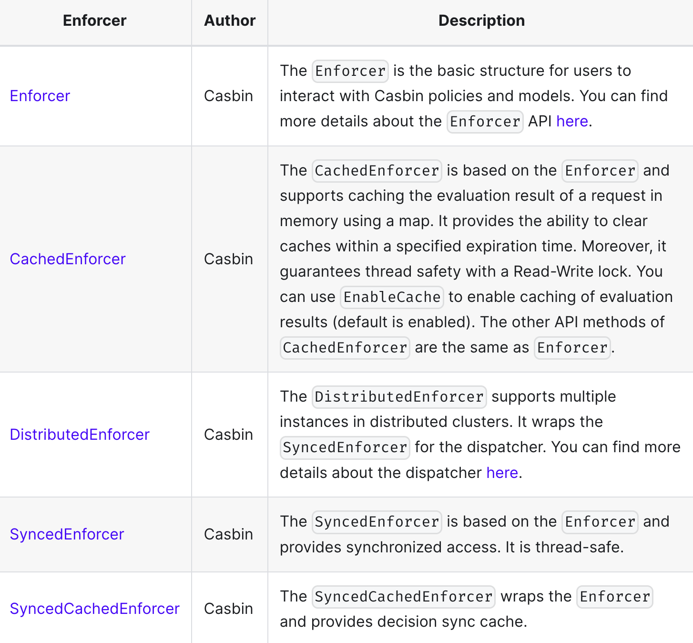

## Enforcers
Enforcer acts as an interface for users to perform operations on policy rules and models.

分布式和多线程使用可以参考下图 (
When using Casbin in a multi-threading environment, you can employ the synchronized wrapper of the Casbin enforcer: https://github.com/casbin/casbin/blob/master/enforcer_synced.go (GoLang). Furthermore, it also provides support for the "AutoLoad" feature, allowing the Casbin enforcer to automatically load the latest policy rules from the database if any changes occur. To initiate the automatic loading of policies periodically, call the "StartAutoLoadPolicy()" function. Likewise, to stop this automatic loading, call the "StopAutoLoadPolicy()" function.)


### Performance Optimization
When applied in a production environment with millions of users or permissions, you may encounter a performance downgrade in Casbin enforcement. There are usually two causes
#### High Volume Traffic
The number of incoming requests per second is too large, for example, 10,000 requests/s for a single Casbin instance. In such cases, a single Casbin instance is usually not enough to handle all the requests. There are two possible solutions:
1. Use multi-threading to enable multiple Casbin instances, so you can fully utilize all the cores in the machine. For more details, see: Multi-threading.
2. Deploy Casbin instances to a cluster (multiple machines) and use Watcher to ensure all Casbin instances are consistent. For more details, see: Watchers.

```bash
Note!
You can use both of the above methods at the same time, for example, deploy Casbin to a 10-machine cluster where each machine has 5 threads simultaneously serving Casbin enforcement requests.
```

#### High Number of Policy Rules
1. Check if your Casbin model or policy is well-designed. A well-written model and policy abstracts out the duplicated logic for each user/tenant and reduces the number of rules to a very small level (< 100). For example, you can share some default rules across all tenants and allow users to customize their rules later.
2. Do sharding to let a Casbin enforcer only load a small set of policy rules. For example, enforcer_0 can serve tenant_0 to tenant_99, while enforcer_1 can serve tenant_100 to tenant_199. To load only a subset of all policy rules, see: Policy Subset Loading.(To use filtered policies with a supported adapter, simply call the LoadFilteredPolicy method.)
3. Grant permissions to RBAC roles instead of users directly. Casbin's RBAC is implemented by a role inheritance tree (as a cache). So, given a user like Alice, Casbin only takes O(1) time to query the RBAC tree for the role-user relationship and perform enforcement. If your g rules don't change often, then the RBAC tree won't need to be constantly updated