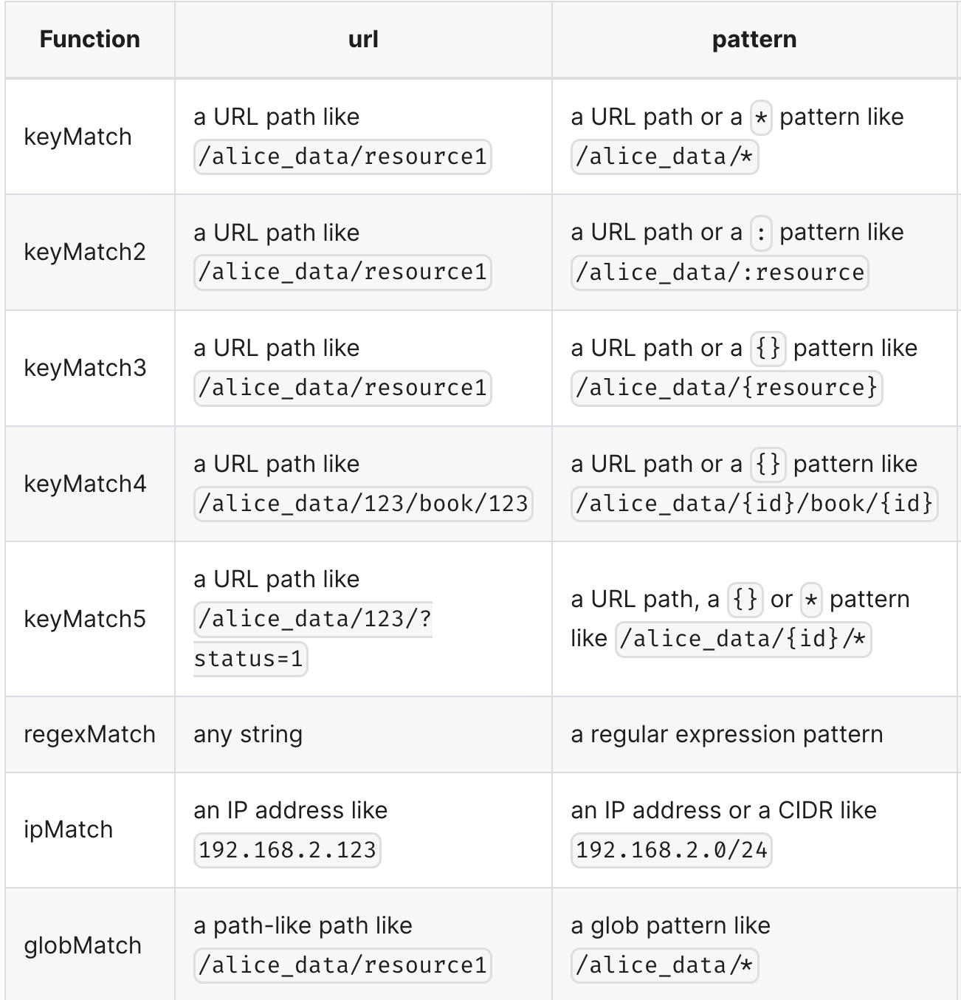

## Functions in matchers
You can even specify functions in a matcher to make it more powerful. 
There are 2 kinds of the functions you can use in matcher
* keyMatch series
* keyGet series
### keyMatch functions
#### keyMatch
```conf
[request_definition]
r = sub, obj, act

[policy_definition]
p = sub, obj, act

[policy_effect]
e = some(where (p.eft == allow))

[matchers]
m = r.sub == p.sub && keyMatch(r.obj, p.obj) && regexMatch(r.act, p.act)
```
```csv
p	alice	/alice_data/*	GET
p	alice	/alice_data/resource1	POST
p	bob	/alice_data/resource2	GET
p	bob	/bob_data/*	POST
p	cathy	/cathy_data	(GET)|(POST)
```

#### keyMatch2
```conf
[request_definition]
r = sub, obj, act

[policy_definition]
p = sub, obj, act

[policy_effect]
e = some(where (p.eft == allow))

[matchers]
m = r.sub == p.sub && keyMatch2(r.obj, p.obj) && regexMatch(r.act, p.act)
```
```csv
p	alice	/alice_data/:resource	GET
p	alice	/alice_data2/:id/using/:resId	GET
```


### keyGet functions
key-getting functions, they usually take three parameters (except keyGet):
```go
bool function_name(string url, string pattern, string key_name)
```
They will return the value of the key key_name if it matches the pattern, and return "" if nothing is matched.

KeyGet2("/resource1/action", "/:res/action", "res") will return "resource1", and KeyGet3("/resource1_admin/action", "/{res}_admin/*", "res") will return "resource1". As for KeyGet, which takes two parameters, KeyGet("/resource1/action", "/*) will return "resource1/action".

### Add a customized function
1. prepare your function
```go
func KeyMatch(key1 string, key2 string) bool {
    i := strings.Index(key2, "*")
    if i == -1 {
        return key1 == key2
    }

    if len(key1) > i {
        return key1[:i] == key2[:i]
    }
    return key1 == key2[:i]
}
```
2. wrap it with `any` types:
```go
func KeyMatchFunc(args ...interface{}) (interface{}, error) {
    name1 := args[0].(string)
    name2 := args[1].(string)

    return (bool)(KeyMatch(name1, name2)), nil
}
```
3. register the function to Casbin enforcer:
```go
e.AddFunction("my_func", KeyMatchFunc)
```
Now, you can use the function in your model CONF like this:
```conf
[matchers]
m = r.sub == p.sub && my_func(r.obj, p.obj) && r.act == p.act
```