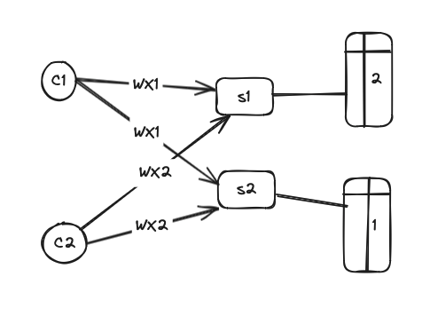
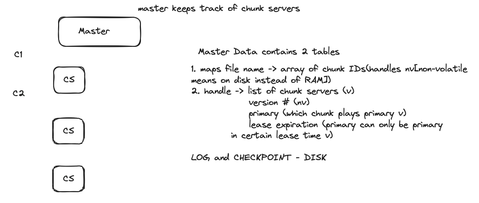
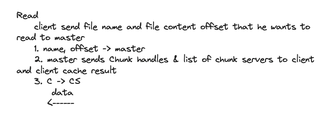
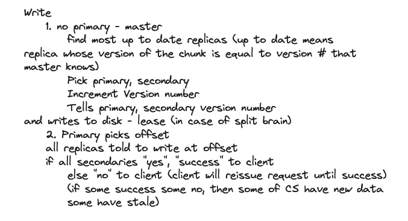

# Big Storage
## Why Hard
* PERFORMANCE -> SHARDING(split data into amount of servers in order to be able to read many servers in parallel)
* FAULTS(when do sharding, hundreds thousands of machines always someone down) -> TOLERANCE  
* TOLERANCE(most powerful ways to get fault tolerance is with replication) -> REPLICATION 
* REPL -> INCONSISTENCY
* CONSISTENCY(if you want consistency, you pay for with low performance) -> LOW PERFORMANCE

## BAD REPL DESIGN

Order of write is not guaranteed, s1 may have x=2 and s2 have x=1, data inconsistency

## Goals of GFS (motive - vast data sets far larger than could be stored in a single disk like entire crawl copy of the web or big youtube video file)
* Big and Fast
* Global(everyone in google share a file)
* Sharding(read fast) 
* Automatic failure recovery

GSF non-goals
1. designed to be single data center 
2. used for google internally
3. Big sequential access

Checkpoint is like you append logs for a while and make record, next time you need recover the data, start recover from the checkpoint.

## GFS operation

GPS master failure need human intervention