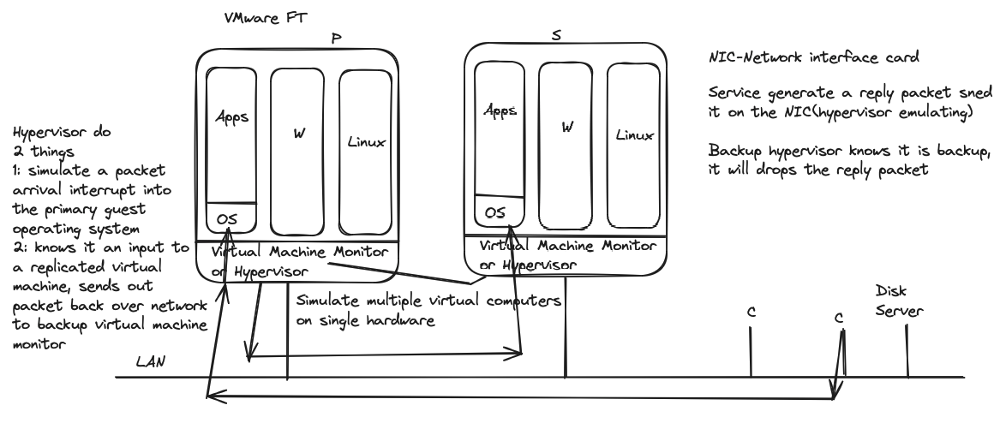
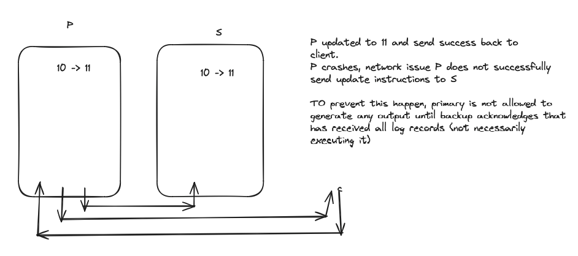

network issue or hardware crashes, the tool make service available is REPLICATION. what kind of failures that replication can be expected to deal with:
* YES fail-stop faults
* NO bugs

STATE TRANSFER(primary send RAM content to secondary) VMware use this schema in multi-core system
REPLICATED STATE MACHINE(send external event/operation) efficient yet complicated

1. What is State? (level on application, GFS paper is low level)
2. how close synchronization between primary and secondary
3. cut-over 
4. Anomalies
5. New replicas

VMware FT

Non-deterministic events
1. Inputs (from external source like clients) - packet - data + interrupt
2. Weird instructions(time instruction etc)
3. multi-core (get lock in different order)

Output rule

After P sending reply to client, it crashes. At the same time, backup packet is in the buffer, it has not been consumed. Then backup increment counter, i will send reply packet to client. Since packet is running over TCP, 2 packets from P and backup would have exactly same packets and TCP will auto drop the second one due to duplication.

There is a TEST-AND-SET service plays as a lock, when split brain happens, two servers will talk to TEST-AND-SET. It will determine who will be the primary. Even if one of them died, other one wants to go alive, it still need talk to TEST-AND-SET to get the lock. you do not know the other server is dead or not, all you know is you do not receive any data from it.