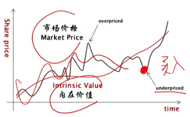

# 框架
## 股票
有价证券, 股份有限公司在筹集资本时向投资者签发的证明股东所持股份和享有权益的凭证
假设1m开店 钱不够.
1. 借钱-债
2. 合伙-股票
### 分类
* 普通股: 发行量最大,  最为重要的股票
* 优先股
    1. 优先分红: 先于普通股获得股息
    2. 分配优先: 清偿顺序优于普通股
    3. 收益相对固定
    4. 权力范围较小: 对公司日常经营管理的一般事项 没有表决权
### 股票的用途

资产(用途) = 负债(借钱)+所有者权益(股票) [资金来源]

* 融资: 支持日常运营(购买机器设备, 原材料; R&D)
* 员工激励机制: 股票期权
    * 发行新股
    * 库存股
* 兼并收购: 以新发型的股票替换目标公司的股票
### 其他重要概念: A股, B股, H股
* A股: 中国境内注册公司发行, 在境内上市， 以人民币认购和交易的普通股票
* B股: 境内上市外资股, 境内注册的股份有限公司, 向境外投资者发行, 并在境内交易所上市的股票. 以人民币标明面值, 以外币认购买卖. B股公司的注册地和上市地都在境内
* H股: 也成国企股, 注册地在内地, 上市地在HK的中资企业股票

### 普通股
#### 基本特征
1. 对公司所有权的凭证
2. 通过投票权, 选举董事会成员来参与公司重要经营事项
3. 分红权(不是公司的义务)
4. 剩余求偿权: 公司破产清算时, 债权人对公司现金及资产的索偿权>优先股股东>普通股股东
#### 回报率构成
1. 资本利得或损失(股价的变化)
2. 股利
3. 汇兑损益
#### 投票权
* 公司可以发行不同类别的普通股
* 不同类别的普通股拥有的投票权不同(同股不同权)
#### 分红
1. 现金分红
    * 定期发放
    * 需要除息: 除息价=股息登记日收盘价 - 每股股息现金金额 [每股 $10, 每股派发 $1, 那现在股价= 10 -1]
    * 股息率 = 每股现金分红/股价
2. 股票分红/送股: 上市公司向股东分配额外的股份
    * 不影响公司现金储备
    * 送股: 将盈余公积或未分配利润转换为权益的分红方式
    * 需除权: 除权价 = 股权登记日的收盘价/(1+每股分红股数) [比如每股80元 100派10 那每股的价格=80/（1+0.1)]
### 优先股
1. 收益相对固定 类似口头协议给你多少分红
2. 分红优先: 分红完了 剩余的 在分给普通股
3. 分配优先
4. 权力范围较小: 对公司日常经营管理的一般事项没有投票权
### 股票的价值
* 市场价值 = 股价 * 在外发行的股票数量 (投资者对未来预期)
* 账面价值 = 总资产 - 总负债

市场价格围绕内在价值波动 内在价值无法准确量化 都是 estimate

#### 股票估值
##### 绝对估值 
现金流折现模型
1. 分红模型: 预测未来几年的现金分红折现加总 
2. FCF Free Cash Flow 自由现金流模型

$V_0 = \sum_{t=1}^{∞}\frac{CF_t}{(1+r)^t}$
##### 相对估值
基本原理: 以可比公司的价格为基础, 来评估目标公司的相应价值
1. 选取基准: 行业平均, 可以公司, 历史的自己
2. 收集财务信息
3. 计算基准的估值比率
4. 计算目标公司的内在价值

常用估值乘数
* 价格乘数
    * P/E = Price/EPS (市盈率)
    * P/B = Price/BVPS (市净率)
    * P/S = Price/Sales (市销率)
    * PEG (市盈率/净利润增长率)
* EV/EBITDA (企业价值/息税折旧摊销前利润)
##### 市盈率
市盈率 = 每股市价/每股盈利

假设 目标公司A的市盈率 10倍, 对标公司B的市盈率 20倍, 所以A被低估可以买入
1. A=10 就是 花10块钱得到 A 公司一个单位的盈利
2. 投资回报时间 花10块钱买入一股, 每股盈利一块. 那十年才能回本, B公司需要二十年才能回本, 所以A被低估了

使用哪一期的盈利数据?
1. 预测数据 PE动态
2. 最近一个完整会计年度的历史数据 PE静态
3. 最近12个月的数据 PE TTM

##### 市净率
市净率 = 每股市价/每股净资产

适用于资产流动性比较高的金融机构, 因为这类公司的资产账面价值更加接近市场价值. 无形资产在账面体现不出来, 重资产和金融公司. 咨询公司就不合适. 

##### 市销率
市销率 = 每股市价/每股销售收入

对于一些无利润甚至亏损的企业, 经营性现金流也为负数, 且账面价值比较低. 比如高成长的科技股和互联网的股票. 此类公司市销率比较实用. 

##### PEG 市盈率/净利润增长率
PE高但是成长性也低: 价值陷阱. 作为 P/E的辅助指标, 该比值 = 1表示估值合理, 比值>1 高估, <1 低估

##### 企业价值/息税折旧摊销前利润
企业价值 = 股权的市场价值 + 债务的市场价值 - 现金及现金等价物 [理解为我要收购这个企业需要支付的成本是多少所以你花钱买了股权, 还了债务, 如果企业有现金和等价物30m, 则相当于你少花了30m]

未计算利息、税款、折旧费用和摊销费用之前的利润水平,对于评估一家公司的真实经营状况和现金流状况很有意义。\
意义在于 两家公司 一个 20%债务 80%股票 和一个 20%股票 80%债务 支付利息会差很多结构完全不一样
##### 不同行业的估值方法
* 传统制造业: P/E
* 金融保险: P/B
* 互联网,新兴,高科技: P/S
* 电信服务商: EV/EBITDA (移动 电信 etc 基站的折旧摊销)
## 债券
可以在市场上买卖的有价证券, 是一个标准化的借款合同, 发行人为了筹集资金而向投资人出具的承诺未来支付利息, 偿还本金的债务凭证
1. Borrower/Issuer/Debitor
2. Lender/Investor/Bondholder/Creditor

### 债券的优点
1. 降低融资成本(相较于股票)
2. 把握控制权(不会有股票稀释的存在)
3. 投资门槛降低
4. 流动性强
### 重要概念
* 发行人
    1. 政府
    2. 公司
    3. 个人
* 期限
    * 债券的存续时间
    * 截至到期日(maturity date), 发行人应该已经偿还了所有合约规定的利息和本金
    * 债券分类:
        1. 短期
        2. 中期
        3. 长期
        4. 永续: 没有明确到期日, 一般5年一个周期选择要不要继续
* 票面价值
* 票息
    * 债券的年化票面利息
    * 票息 = 面值 x 票面利率
        * coupon rate: 年化票面利率即债券的名义利率
        * 付息频率: 常见的一年1次 一年2次 ($100, 5%, 两次就是一次 $2.5)
* 币种
    * 债券发行的货币形式
    * 两种特殊的债券
        * Dual-currency bonds: 用某一币种支付利息, 用另币种偿还本金(日企美国建厂 本金美元, 然后周期性长没收入, 母公司用 日元付息. 规避汇率风险)
        * Currency option bonds: 投资者可以选择以什么币种收取利息和本金(一般都是 2 个币种二选一, 一般都是币种的流动性和波动性比较差的国家)

### 发行和交易
一级市场    二级市场\
发债人->投资人A->投资人B
## 基金
通过向投资者募集资金, 形成独立基金财产, 由船业投资机构(基金管理人)进行几斤肉子与管理, 由基金托管人进行资产托管, 由基金投资人共享投资收益, 共担投资风险的一种集合投资方式.
### 分类
#### 运作方式
* 封闭式: 份额数量固定(赎回只能走转让形式)
* 开放式: 份额可以变化(申购和赎回可以同基金公司交易)
#### 投资标的
* 股票基金: 80% 投入股票市场
* 债券基金: 80% 投入债券市场
* 混合基金: 
* 货币市场基金: 
#### 投资理论
* 主动型: 通过积极选股和择时, 力图打败市场, 依靠对未来市场的预测
* 被动型: 以特定指数为跟踪对象, 力图复制指数, 基于历史回报率判断
#### 按募集方法
* 公募
* 私募
### 基金估值
确定基金资产公允价值

基金资产净值 = 基金资产的总价值 - 基金所有负债

基金份额净值 = 基金资产净值/基金总份额: 计算投资者申购基金份额, 赎回资金金额的基础, 也是评价基金投资业绩的基础指标之一. 每天一个数值, 不像股票一直在变. 开放式基金认购赎回的基准就是 基金份额净值. 
### 主动和被动
#### 主动
募集说明书介绍了投资理念, 投资范围, 投资策略. 以期跑赢市场. 主要依靠基金经理的个人能力
#### 被动
都是追踪指数的基金
##### ETF Exchange-Traded Fund 交易所交易基金
1. 可以像封闭式基金一样在交易所二级市场进行买卖
2. 可以像开放式基金一样申购和赎回
3. 实物申购 实物赎回

比如 标普500 ETF 完美拟合 标普500指数, 买了这个 ETF 就相当于买了这个指数.

怎么玩的呢? 大型机构把 比如 上证指数的股票买一遍, 然后去 基金公司 比如华夏基金 换取份额, 然后在二级市场出售这些份额

##### 指数基金
ETF和指数基金
1. 交易方式
    * 需要股票账户买卖
    * 购买渠道多, 支付宝,天天基金, 基金公司直销等
2. 估值方式
    * 跟股票一样按实时价格成交, 实时估值(二级市场报价)
    * 当天交易日完成后才能确定基金净值
3. 费用
    * 佣金+管理费 管理费一般低于指数基金
    * 管理费一般稍高
4. 指数跟踪误差
    * 较低(一二级市场价格不一致会有套利出现, 套利人多就会很快趋同 所以跟踪指数的误差也比较低)
    * 高于ETF

作出如上对比本质就是两者是一样的
##### ETF联接基金
跟踪ETF基金的指数基金, 基本与ETF一样, 最大的好处是不用股票账户就能买卖

### 有效市场
* weak-form efficiency: 反应的信息范围主要为历史信息
* semi-strong-form efficiency: 除了历史信息， 即股票的历史价格, 交易量等历史信息外, 还包括公司基本面等公开信息
* strong-form: 所有信息(包括内幕信息)

美股处于弱有效和半有效之间, A股连弱有效都不是

### 特殊类型基金
* QDII 基金
    * Qualified Domestic Institutional Investor 合格境内机构投资者
    * 在一国境内设立, 经该国有关部门批准, 从事境外证券市场的股票, 债等有价证券投资的基金
    * 为国内的投资者参与国际市场投资提供了便利
* QFII 基金
    * Qualified Foreign Institutional Investor 合格境外机构投资者
    * 外国专业投资机构到境内投资的资格认定制度
    * 为国外投资者参与国内市场投资提供了便利
* FOF 基金中基金 or 母基金
    * 以其他基金为投资对象的基金
    * 中国证监会的分类标准下, 80%以上的基金资产投资于其他基金份额的为FOF
    * 双重收费 FOF收你钱 子基金的管理费也是用户摊
## 衍生品
以股票, 债券, 货币, 或商品等基础资产所构成或者衍生而来的交易合约, 这些基础资产通常被称为合约的标的资产.

期货比远期标准化

### 分类
1. 交易所交易的衍生工具
2. 场外交易市场 OTC 交易的衍生工具
### 特点
* 跨期性(根据价格变化的预测 未来按照某一个条件进行交易或者是否交易)
* 杠杆性(少量自由资金+大量借钱 来买入)
* 联动性(衍生资产的标的资产的价格有联动性)
* 不确定性或高风险性(合约资产标的价格的变化导致衍生产品的价格变化)