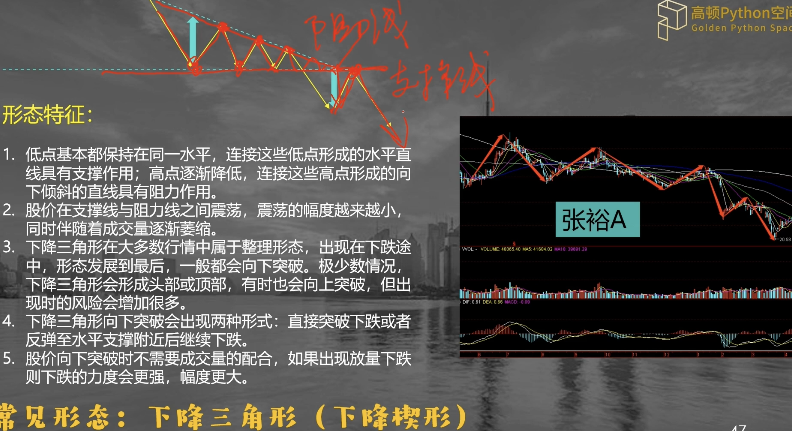

# 技术面分析
## K线基本形
* 白线: 大盘加权指数 一般说的点位也是这条线(白线好近似大盘股好 因为权重大)
* 黄线: 不考虑加权因素 假设每个股票影响一样画出来的线(黄线好近似小盘股好因为不考虑权重)

大盘股:也叫大盘股,是指流通盘比较大的股票,一般在50亿以上,其市值占到了股票总市值的50%以上。而小盘股是指流通盘在10亿以下的股票

4个特征值
1. 最高价
2. 最低价
3. 开盘价
4. 收盘价

## 三大假设
1. 市场行为包容消化一切信息
2. 市场运行以趋势方式演变
3. 历史会重演

## 均线系统
### 单均线
30日移动均线: 过去30天每天收盘价, 算出算术平均数, 得到一个数字, 明天在算一个, 算够30 天, 连出一条线

价格在均线上买入K线在均线下卖出 都是信号

### 双均线
一个短期一个长期均线 以30MA 和 120MA为例
1. 短期均线向下穿过长期均线形成死叉, 表示要卖了
2. 短期均线向上穿过长期均线形成金叉, 可以买入了

### 讨论
#### 不同的时间周期
* 分钟/小时/日/周/月/季/年

长期投资关注日周甚至月的K线 短期关注 分钟小时K线
#### 计算不同长度的均线
* 短: 5/10/20/30
* 长: 60/90/120/240
#### 单双四均线
四均线: 2短2长
10/30 MA 和 90/120 MA 怎么看呢\
90 上穿 120 中长期上涨 10 和 30 波动可以接受 找10穿30 买入
#### 趋势 vs 震荡
* 均线系统可以容易在趋势中获利
* 参数选择不合适遇到震荡会多次提醒买入卖出 从而浪费手续费

## MACD 
Moving Average Convergence and Divergence 移动均线聚合分离. 利用收盘价的短期(常用 12d)指数移动平均线与长期(常用 26d) 指数移动平均线之间的聚合与分离状况对迈进和卖出作出研判
### 计算
Exponential Moving Average
* EMA(12) = 前一日 EMA (12) x 11/13 + 今日收盘价 x 2/13  
* EMA(26) = 前一日 EMA (26) x 25/27 + 今日收盘价 x 2/27
* 离差值 DIF: DIF = 今日 EMA (12) - 今日 EMA (26)
* 离差平均值 DEA: 今日 DEA (MACD) = 前一日 DEA x 8/10 - 今日 DIF x 2/10
* 计算出的 DIF 和 DEA 的数值均为正值或负值, 用 (DIF - DEA) x 2 即为 MACD 柱状图. DIF 变化速度, DEA 变化速度平均值, 变化速度改变幅度, 类似加速度?

#### 快线 EMA 12, 慢线 EMA 26, 快穿慢

#### 红绿柱状转换
* 卖: 红->绿
* 买: 绿->红

#### MACD结合K线
股票指数价格 新高/新低 但是 MACD 黄白线 并没有, 持平甚至下跌/升高, 即为 背离或者背驰 这时候注意买入和卖出时机
1. 图1 连续两次 顶背离 股票市场有一个非常的调整
2. 图2 股票价格新高 MACD 甚至降低了

以上两种情况即跑路信号

价格下跌到新低点, 下破新低点时候, MACD却涨了 可以买了. 也要注意, MACD 跨 0 轴 才更有意义

## KDJ 
一般用于期货, 敏感度高. 敏感度高稳定性就差.
RSV Raw Stochastic Value: 未成熟随机值

RSV = (今天收盘价 - 9天最低价)/(9天最高价 - 9天最低价)

K = 2/3前日K值 + 1/3 当日RSV

最慢线 D = 2/3前日D值 + 1/3当日K值

最快线 J = 3K - 2D

1/3 和 2/3? why 黄金分割比. RSV中的 9 也是为了方便计算 1/3 

算RSV 一些初始值 K=50 然后算出来 KDJ各值

1. 可以买: J < 0 or K,D < 20
2. 可以卖: J > 100 or K,D > 80

主要就是观察 KDJ 的一个趋势 以及 K 线的一个价格 当价格变化和趋势变化不一致的时候就是该 买入 或 卖出 的时候

## RSI
作为辅助指标 结合其他指标效果更好

过去 6 天 RSI = +2 +3 -2 +1 -1 +3

平均每日上涨 (2+3+1+3)/6= 1.5\
每日下跌 (-2-1)/6 = -0.5\
RSI = 1.5/(1.5+0.5) = 75%
1. 可与买: RSI < 20%
2. 可以卖: RSI > 80%

## 布林轨道
Boll, 通过计算股价的 标准差, 再求估价的 信赖区间.
### 计算
* 中轨线 = N的移动平均线
* 上轨线 = 中轨线 + 两倍的标准差
* 下轨线 = 中轨线 - 两倍的标准差

* 买入: 股票价格接近下轨线
* 卖出: 股票价格突破上轨线

上述规则适用于一般趋势图, 波动型的需要借助 中轨线 趋势来判断买入卖出时机

### 讨论
* 缩口: 上中下轨线接近 即估价相对平稳
* 开口: 股票价格波动 3线间距变大

#### 配合MACD使用
比如先看 MACD 死叉, 然后看Boll 中轨向下, 上下轨开口变大

## 成交量
* 广义: 成交股数, 成交金额, 换手率
* 狭义: 成交股数

1. 缩量上涨: 股票价格上涨但是成交量低 会跌
2. 放量下跌: 股票价格下跌成交量变大 更跌

不能只看绝对值 看的是前后的对比

### 特殊形态

## 换手率
一定时间的范围之内, 某只股票的累积成交股数喝流通股之间的比率
* 大约 70% 的股票每日换手率约为 1%～3%, 说明 3% 是一个重要的分水岭
* 当一个股票的换手率 3%～7% 左右, 股价已经进入相对活跃的状态, 应当引起注意
* 当一个股票换手率超过 10% 属于股价走势高度活跃的状态, 正在呗市场广泛关注

* 高位高换手 可以跑了
* 低位高换手 考虑买入

## 主力运作

### 建仓

### 试盘

### 洗盘

建仓时候和中间上车获利的人洗出去. 提高平均持股成本, 以后拉盘的时候不会轻易砸盘. 

### 拉升

4 指的是技术派看到指标符合之后跟风进场

### 出货

## 风险
金融世界对风险的定义: 收益的不确定性

### 风险的度量
#### 方差
衡量数据与均值之间的偏离程度
#### 标准差
波动率
#### 贝塔 β
衡量 系统性风险 常用的指标, 代表 资产收益率 和 市场收益率之间的敏感度. 什么意思呢, 假设 β = 1.5, 大盘涨 1%, 使用此策略, 资产涨 1.5%. 

对于 充分分散化的 组合来说, 贝塔是有效的风险度量指标

#### 下行风险
另类投资的风险度量, 包括: 对冲, 私募, 古玩字画, 大宗商品等
* 最大回撤 maximum drawdown: 最高点到最低点最大跌幅, 描述产品可能出现的最糟糕状况
* 半标准差: 计算 回报 0轴以下的, 因为关心的是亏钱的波动

#### 在险价值 VaR Value at Risk
资产组合在 一定时期内, 一定概率下 损失可能达到的金额, 因其结合了 时间,概率, 损失额 的概念, 在风险管理中成为受欢迎的指标. 

10 day 99% VaR 等于 $100k
1. 未来10天 99% 概率损失 100k
2. 未来10天 1% 概率损失不超过 100k

## 收益率
1. 无风险收益率: 不承担风险就可以获得的收益率, 即投资无风险资产, 例如国债, 可以获得的收益率
2. 风险收益率(风险溢价): 承担风险所获得的补偿, 基于风险厌恶的假设, 风险越大, 溢价越大. 常见的风险包括: 违约风险, 期限风险, 流动性风险等 

### 资本资产定价模型 Capital Asset Pricing Model CAPM
量化资产的系统性风险, 目的是为了找到资产的 合理预期收益率, 本质是在给风险 "定价"

CAPM 模型以 市场风险作为唯一影响因素, 认为一个资产的收益率应该包含两个部分(因为传统金融学默认非系统性风险可以通过分散投资组合而规避)
1. 无风险收益率
2. 因为承担了系统性风险 而获得的收益

系统性风险由敏感度 β 衡量: $E(R_i) = R_f + β_i[E(R_m)-R_f] $

$R_f$ risk free rate, 一般10年期国债收益率

### 业绩评估 - 风险调整后的收益率
风险调整后的收益率: 对于收益率相同的投资组合, 风险越小的越有吸引力. 在评估资产组合的表现时, 需要同时考虑 回报 和 风险 的因素. 

#### 常见的风险调整后收益率

超额收益指的是投资组合的收益超出无风险利率的部分

1. 夏普比率(Sharpe ratio): 单位总风险下的超额回报
    * $[E(R_p)-R_f]/σ_p$ 预期回报率-无风险收益/标准差(资产总风险)
    * 解读: 期望收益率 11%, 无风险收益率 3%, 收益标准差 16% -> SR = 0.5 承担一个单位的总风险得到 0.5 的回报
    * 未考虑分散化的好处, 所以对资产进行 单独分析 时更有效
2. 特雷诺指数(Treynor ratio): 单位系统性风险下的超额回报
    * $[E(R_p)-R_f]/β_p$ 
    * 解读: 期望收益率为 11%, 无风险收益率 3%, β为 1.6 -> TR = 5 承担一个单位的市场风险可以得到 5 个单位的超额收益
3. 索提挪比率(Sortino ratio): 单位下行风险下的超额回报 (适用于对冲基金 私募股权基金, 收益往往不像股票债券等是对称的, 不是正太分布的)
    * $[E(R_p)-R_target]/semi\ σ_p$

### 阿尔法 α
资产收益超过理论收益部分的度量

$α_p = R_p - (R_f + β_p[E(R_m)-R_f])$ 实际回报 - 预期收益(见CAPM模型) 