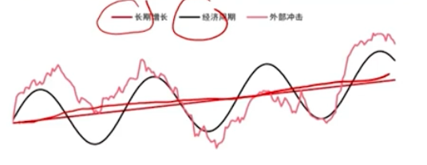
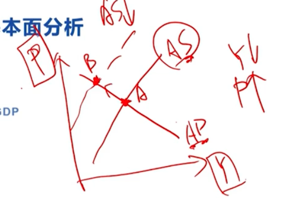
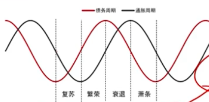
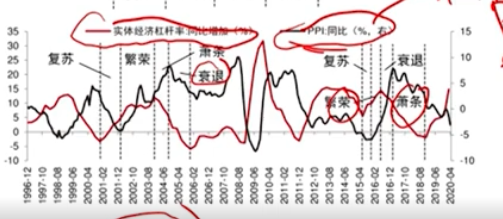
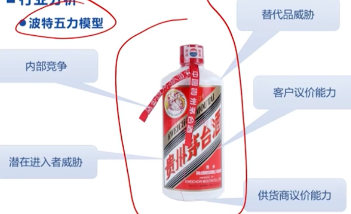
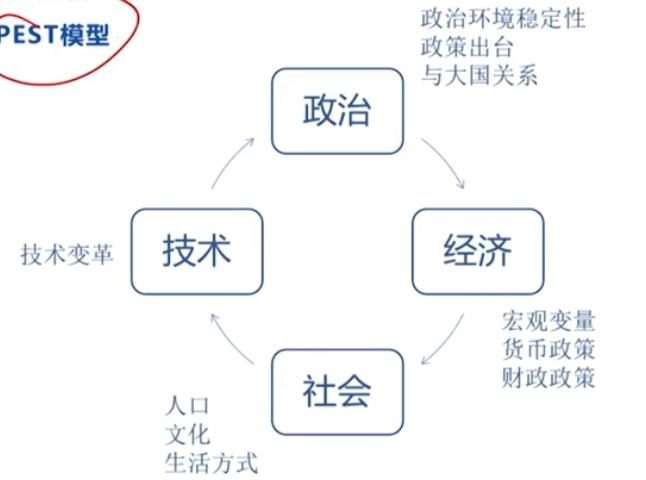
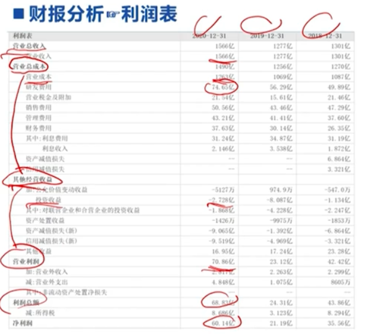
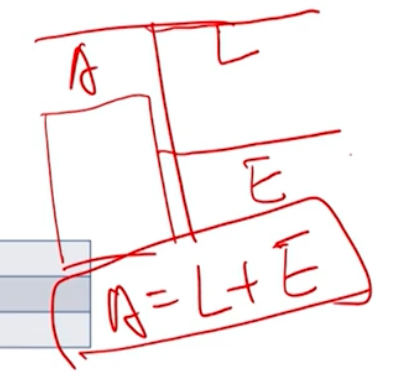

# 策略构建 
## 基本面分析
自上而下重要指标
1. 宏观分析
    1. GDP增速
    2. 通货澎涨
2. 行业分析
    1. 供需分析
    2. 波特五力模型
    3. PEST模型
3. 目标公司分析
    1. 财报分析 (资产负债表, 现金流量表, 利润表)
    2. 估值建模 (不止分析当下 预测未来业绩)

### 宏观经济分析
* 经济周期
    * 扩张期, 收缩期
    * 顶峰, 底部 

#### GPD 增速
商品 A B C, 价格 Pa Pb Pc 产量 Qa Qb Qc
* 名义GDP: Pa*Qa + Pb*Qb + Pc*Qc
* 实际GDP: pick a base year for example 2010 then Pa2010*Qa + Pb2010*Qb + Pc2010*Qc

##### GPD 增速与行业
* 周期性行业 (房地产 金融 煤炭 有色金属)
* 非周期性行业 (食品 饮料 医药 保健)

GDP增速对周期性行业很重要 
GPD涨 1% 失业率下降 2%左右
#### 通货膨胀
* CPI指数(Customer Price Indicator) 计算通货膨胀率
* 通货紧缩 价格水平持续下降 消费者推迟消费(因为未来价格更便宜) 投资者企业家推迟投资 需求供给下降 整个经济收缩
* 滞涨 

P - 价格指数 Y - GDP AS - Aggregate Supply AD - Aggregate Demand

* 实体经济杠杆率: 实体经济部门（包括家庭、企业和政府）相对于其收入或资产的债务水平 杠杆率=总债务/GDP 总债务包含 家庭债务, 企业和政府债务 
* 债务周期: 经济体中债务水平的周期性波动
    1. 扩张阶段: 接待增加, 消费和投资上升, 经济增长强劲. 利率通常较低, 信贷条件宽松, 资产价格上升, 推动经济进一步扩张.
    2. 收缩阶段: 当债务水平达到不可持续的高度时, 经济进入收缩阶段. 借贷减少, 消费和投资下降, 经济增长放缓. 为了偿还债务, 经济体可能需要经历去杠杆化过程. 导致资产价格下跌和金融市场动荡. (去杠杆化 Deleveraging 是指在经济活动和金融操作中，减少债务或杠杆率的过程。这个过程通常涉及减少借贷、偿还债务、降低负债水平，或通过增加资本来改善资产负债表的健康状况)

PPI = producer price indicator

## 行业分析
### 供需分析
1. 需求扩张 供应扩张 (新兴市场)
2. 需求扩张 供应稳定 (最佳格局) 茅台
3. 需求稳定 供应减少 (成熟行业) 头部化 家电 
4. 需求稳定 供应稳定 (碎片化市场) 餐饮 没有一统江山的
5. 需求稳定 供应增加 (新科技出现) 页岩油采集->石油变多->供应增加
6. 需求减少 供应减少 (夕阳行业) 胶卷 MP3 缝纫机 etc

比如 2, 看产业链分布, 上市公司玩家 etc. 3 看头部公司

### 波特五力模型

1. 内部竞争: 四川酒去到山西 高
2. 潜在进入者威胁: 低
3. 替代品威胁: 低
4. 客户议价能力: 低 (涨价消费者还是买)
5. 供货商议价能力: 低 (水和高粱)

### PEST 模型

1. Politics
    * 政治稳定性
    * 政策出台: 比如供给侧改革-打压落后产业, 比如新能源汽车-补贴,支持
    * 与大国关系: 美中芯片 中美农产品
2. Economics
    * 宏观变量: GDP增速 Inflation 就业情况
    * 货币政策: 央行制定 
        1. 宽松 - 央行注入流动性, 钱多了追逐利益, 基本面变好
        2. 紧缩 - 央行抽干流动性, 市场流动货币数量降低, 钱少了 资产价格难以推动
    * 财政政策: 政府制定 税收和支出
        1. 宽松 - 花钱多 比如 学校 医院 地铁 公路 拉动各行业发展
        2. 紧缩 - 花钱少 不再随意基建
3. Society
    * 人口: 老龄化来临 保健 医疗 养老等行业利好
    * 文化: 
    * 生活方式: 线上线下购物方式的改变
4. Technology
    * 技术变革: 新能源 各大汽车转型

行业研究供需入手 波特五力研究是否值得 PEST分析 最终得出结论

## 公司分析
### 认识公司第一步, 从年报开始
年度报告结构如下: 
1. 重要提示,目录和释义 - 关联方, 子公司, 分公司 等缩写
2. 公司简介和主要财务目标 - 生产什么产品 做什么服务
3. 业务概要 
4. 经营情况讨论与分析 - 对过去一年总结未来期许
5. 重要事项 - 是否卷入法律诉讼 是否分拆 是否股票分红 是否兼并等
6. 股份变动以及股东情况
7. 可转换公司债券和相关情况
8. 董事,监事,高级管理人员和员工情况
9. 公司治理
10. 公司债券相关情况
11. 财务报告
12. 备查文件目录 - 想知道某些问题细节可以到某个文件中查找

* 主营业务
    * 公司业务概要和公司简介
* 核心竞争力分析
* 主要销售客户和供货商情况
    * 普通大众和公司层面比如出租车 (上游)
    * 关键部件供货商是否有很强的议价能力 - 如果是 则成本难以控制降低 (下游)
* 研发投入
* 公司未来发展规划

### 财报分析
#### 利润表
代表着 公司经营成果的表现. 着重分析以下两个能力:
1. 盈利能力
    * 毛利率 (Revenue营收-COGS生产成本)/ Revenue
    * 净利率 Net income / Revenue
    * 股东回报率 (ROE) Net income / equity value权益价值
    * 每股净利润 (EPS) Net income/ total shares 

毛/净利率 怎么分析纵向分析历史来看 横向分析其他车企 

P/E 公司股票价格贵还是便宜 可以通过此标准判断 P=price per share E=EPS 

P/E低股票相对便宜值得投资

2. 成长性
    * 销售收入增速
    * 净利润增速
    * 过去三年销售收入符合增速
    * 过去三年净利润复合增速

#### 资产负债表
代表着 公司经营状况的表现

Asset = Liabilities + Equity \
资产=负债+股东权益

1. 短期偿债能力指标
    * 流动比率 = 流动资产/流动负债
    * 速动比率 = (流动资产-存活)/流动负债
    * 现金比率 = (现金+有价证券)/流动负债
2. 长期偿债能力指标
    * 负债比率 = 负债总额/资产总额
    * 利息收入倍数=经营净利润/利息费用 (利息费用是企业从银行贷款每年需要还的钱)

#### 现金流量表
代表着 公司健康经营的表现

1. 三种现金流类型(现金流有入有出)
    * 经营性现金流 
    * 投资性现金流(买土地盖工厂购入设备)净额为负不一定不好 比如投资扩建
    * 融资性现金流(为了买土地盖厂房 找银行贷款 本金偿付 利息付出等)
2. 现金流的数量和质量
    * 经营性净现金流(轧差之后的值) 和 公司净利润 相比 如果相差甚远 说明很不健康 现金流质量低

### 估值建模
#### 预测3张报表的值
预测接下来3年3张报表的值 然后作为输入填入到下面的估值模型
#### 建模
* 股利折现模型
* 自由现金流模型
* 价格乘数模型
#### 估值
是否是投资好时机 如果不是当股票价格跌到什么地方 或 当其他价格乘数下降到什么地方的时候可以作为很好的入场机会 