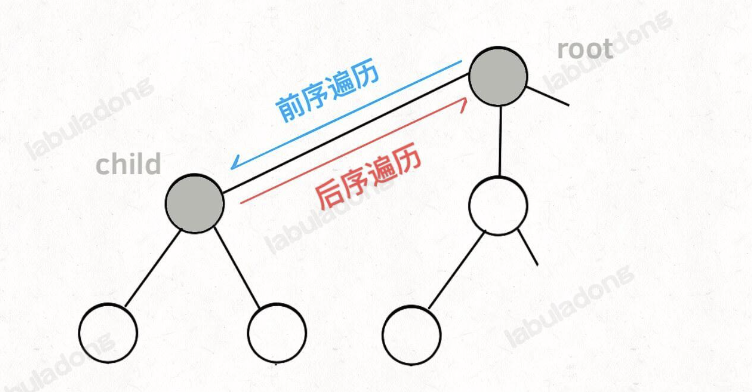

<!-- n个数的全排列能有 n 个排列, 即 时间复杂度最低也都是 O(N!), 因为穷举整个决策树是无法避免的. 

回溯 -  多叉树遍历
动态规划 - 1. 暴力穷举(状态转移方程) 2. 加备忘录即自顶向下递归 3. 优化之后自底向上地推迭代 4. 空间压缩
数组 -  -->


## 1.1
### 1.1.1 数据结构的存储方式
数据存储方式只有两种：数组（顺序存储）和链表（链式存储）
1. 队列和栈 可以用 array 和 linked list实现
2. 图 邻接表就是链表 邻接矩阵就是二维矩阵
3. 树 数组实现就是堆  链表就是正常普通的树
4. map 拉链 数组配链表 开放寻址 数组

实际应用中 Redis 的各种数据结构底层都是用了两种实现方式

### 1.1.2 数据结构的基本操作
基本操作 遍历+访问 具体就是 CURD

遍历：
1. for/while 迭代
2. 递归

```python
from typing import List, Optional
class TreeNode:
    # Optional类型提示用于表示一个变量可以是某种类型或None
    def __init__(self,val: int=0,children: Optional[List['TreeNode']]=None):
        self.val=val
        self.children = children if children is not None else []
    def traverse(self,root: 'TreeNode')->None:
        for child in root.children:
            self.traverse(child)
```
### 1.1.3 刷题指南
数组/链表->二叉树->二叉树->二叉树->回溯->递归
## 1.2
### 1.2.1 算法本质
<b><i>"穷举"</i></b>
刷题一般都是2种情况
1. 如何穷举 - 一般是递归类问题, 典型就是动态规划系列
2. 如何聪明的穷举 - 非递归类穷举, 大佬发明, 会就是会, 没学过基本就是不会

### 1.2.2 数组/单链表
双指针(一快一慢 中间两边 两边中间) 排序 前缀和 差分 
### 1.2.3 二叉树系列
1. 回溯套路(回溯本质就是多叉树遍历) 遍历二叉树
2. 动态规划套路 分解问题
#### 1.2.3.1 遍历 回溯套路
```python
# 二叉树遍历套路 取最深度
depth = 0
res=0
def traverse(root: TreeNode, k: int) -> None:
    global depth,res
    if root == None:
        return math.max(res,depth)
    
    depth+=1
    traverse(root.left)
    traverse(root.right)
    depth-=1

# 回溯套路 求全排列(全排列来回颠倒数字位置)
res=[]
track=[]
def backtrack(nums: Optional[List[int]]=None):
    if len(track) == len(nums):
        res.append(track)
        return
    for i in range(len(nums)):
        if nums[i] in track:
            continue
        track.add(nums[i])
        backtrack(nums)
        track.pop()
```
#### 1.2.3.2 分解问题 动态规划套路
```python
# 分解问题求最大深度
def max_depth(root: TreeNode)->int:
    if root ==None:
        return 0
    left_max=max_depth(root.left)
    right_max=max_depth(root.right)
    res = math.max(left_max,right_max)+1
    return res

# 动态规划凑零钱
# 输入金额 amount 返回凑出 amount 的最少硬币个数
def coin_change(coins: Optional[List[int]],amount:int):
    # base case
    if amount==0:
        return 0
    if amount<0:
        return -1
    
    res = float('inf')
    
    for coin in coins:
        # 递归计算凑出 amount - coin 的最少硬币个数
        sub_problem=coin_change(coins,amount-coin)
        if sub_problem==-1:
            continue
        # 凑出 amount 的最少硬币个数
        res=math.min(res,sub_problem+1)

    return -1 if float('inf')==res else res
```

## 1.3 动态规划解题套路框架
动态规划问题的一般形式是 求最值. 求最值的核心问题就是 穷举. 

正确的 "状态转移方程" 才能正确穷举. 判断算法是否有 "最优子结构", 可以通过自问题的最值的到原问题的最值. DP还有重叠子问题的存在. Memo 或者 DP table 优化 穷举过程

明确 base case -> 明确 "状态" -> 明确 "选择" -> 定义 dp 数组/函数的含义

框架如下:
```python
# 自顶向下递归的动态规划
def dp(状态1,状态2, ...):
    for 选择 in 所有可能的选择:
        # 此时的状态已经因为做了选择而改变
        result = 求最值(result, dp(状态1, 状态2, ...))
    return result

# 自底向上迭代的动态规划
# 初始化 base case
dp[0][0][...] = base case
# 进行状态转移
for 状态1 in 状态1的所有取值:
    for 状态2 in 状态2的所有取值:
        for ...
            dp[状态1][状态2][...]=求最值(选择1, 选择2, ...)
```
## 1.3.1 斐波那契
但凡遇到递归问题 最好都要画出递归树 看到这的时候 自己画下递归树
#### 1. 暴力递归
```python
def fib(N: int):
    if N==1 or N==2:
        return 1
    return fib(N-1)+fib(N-2)
```
递归算法的时间复杂度计算 - 子问题个数乘以解决一个子问题需要的时间 O(2^N)


#### 2. memo 递归
```python
def fib(n: int):
    memo=[0]*(n+1)
    return helper(memo,n)

def helper(memo: List[int], n:int):
    # base case
    if n==0 or n ==1:
        return n
    # calculated
    if memo[n]!=0:
        return memo[n]
    # 递归
    memo[n]=helper(memo,n-1)+helper(memo,n-2)
    return memo[n]

```
算法复杂度 O(N)
#### 3. dp 数组的迭代递推法
```python
def fib(int n):
    if n==0:
        return 0
    dp=[0]*(n+1)
    dp[0]=0
    dp[1]=1
    for i in range(2,n+1):
        dp[i]=dp[i-1]+dp[i-2]
    return dp[n]
```
```
        1, n=1,2
f(n)=
        f(n-1)+f(n-2),n>2
```
```python
# 从状态转移方程来看 用不到那么多空间
# 空间复杂度 O(1)
def fib(n: int)->int:
    if (n==0 || n==1):
        return n
    dp_i_1=1
    dp_i_2=0
    for i in range(2,len(n+1)):
        dp_i=dp_i_1+dp_i_2
        dp_i_2=dp_i_1
        dp_i_1=dp_i
    return dp_i_1
```
以上的优化一般是DP问题的最后一步优化, 如果每次状态转移至需要 DP table中的一部分, 那么可以尝试缩小DP table的大小
### 1.3.2 凑零钱
给你k种面值的硬币, 分别为c1, c2, ..., ck, 每种硬币数量无限, 总金额 amount, 问最少需要几枚硬币凑出这个金额, 如果不可能凑出 返回 -1
#### 1. 暴力递归
DP问题的本质是具有 最优子结构. 什么意思呢 就是 子问题 之间相互独立. 到凑零钱的问题, 如果 amount=11, 面值 1,2,5. amount=10,9,6 的最小硬币数 + 1 就是 amount=11 的最小硬币数. 因为硬币数无限 所以子问题之间没有制约. 
```python
def coin_change(coins:List[int], amount:int)
```
思考转移方程:
1. 确定 base case, 目标金额 amount 为0 返回0
2. 确定状态 即原问题和子问题的中变化的量 本例中为金额 amount
3. 确定选择 导致状态产生变化的原因 本例中为 选择哪个 面值的硬币
4. 明确 dp 函数/数组 一般来说 函数的参数就是 状态; 返回值是题目要求我们计算的 量/最值

所以 dp 函数这样定义: dp(n)表示 输入一个目标金额 返回凑出来目标金额n 所需要的最近硬币数
```python
# pseudo code
def coin_change(coins:List[int], amount:int)->int:
    return dp(coins, amount)
def dp(coins:List[int],amount:int)->int:
    for coin in coins:
        res = min(res,1 + dp(coins, n-coin))
    return res
```
加上 base case
```python

def coin_change(coins:List[int], amount:int)->int:
    return dp(coins, amount)

def dp(coins:List[int],amount:int)->int:
    # base case
    if amount==0:
        return 0
    if amount<0:
        return -1

    res = float('inf')
    for coin in coins:
        sub=dp(coins, amount - coin)
        if sub == -1:
            continue
        res = math.min(res, sub+1)

    return -1 if res==float('inf') else res
```
```
        0, n=0
dp(n)   -1, n<0
        min{ dp(n-coin)+1 | coin ∈ coins},n > 0
```
递归算法的时间复杂度分析: 子问题总数 X 解决每个

1. target amount N, 硬币面值种类为 k, 递归书最坏情况下高度为 N, 假设满 k 叉树, 则节点总数 $O(k^N)$.
2. 再看每个子问题的复杂度, 每次递归包含一个 for 循环, 复杂度 O(k), 总体复杂度 $O(k * k^N)$

#### 2. memo 递归
```python
def coin_change(coins: List[int], amount: int)->amount:
    # 初始化一个不会被取到的特殊值, 代表不会被计算
    memo = [-666]*(amount+1)
    
    return dp(coins, amount)

def dp(coins: List[int], amount: int)->amount:
    if amount == 0:
        return 0
    if amount<0:
        return -1
    if memo[amount]!=-666:
        return memo[amount]
    
    res=float('inf')
    for coin in coins:
        sub = dp(coins, amount-coin)
        if (sub==-1):
            continue
        res=math.min(res,sub+1)
    memo[amount] = res if res!=float('inf') else -1
    return memo[amount]
```
此时 子问题 冗余消失, 子问题 总数不会超过 金额数 N, 所以 O(N), 一个子问题的时间仍然是 O(k), 所以 总体是 O(k*N)

#### 3. dp数组的迭代解法
dp 函数的体现在函数参数, dp 数组体现着数组索引
dp数组的定义: 当木目标 amount 为 i 时, 至少需要 dp[i] 枚硬币凑出目标 amount
```python
def coin_change(coins: List[int], amount: int)->int:
    # 初始化
    dp=[amount+1]*(amount+1)
    # base case
    dp[0]=0
    # outer loop 遍历所有状态取值
    for i in range(0,amount+1):
        # inner loop 遍历 找选择的最小值 
        for coin in coins:
            if (i-coin)<0:
                continue
            dp[i]=main.min(dp[i],dp[i-coin]+1)
    return ap[amount] if dp[amount]!=amount+1 else -1

```
## 1.4 回溯算法
解决一个回溯问题, 实际上就是一个决策树的遍历过程, 站在回溯树的一个节点上, 你只需要思考3个问题:
1. 路径 已经作出的选择
2. 先泽列表 当前可以做的选择
3. 结束条件 到达决策树底层 无法在做选择的条件
```python
result=[]
def backtrack(path, choices):
    if condition true:
        result.add(path)
    for choice in choices:
        make choice
        backtrack(path, choices)
        revoke choice

```
其核心就是 for 循环里面的递归
### 1.4.1 全排列
给你3个数 [1,2,3] 列举出所有的排列 一共是3! 个  n个数就是 n!个

* [2]是path, record choices you have made. 
* [1,3] is available choice list
* choice list empty 就是结束条件, 即遍历到树的底层了   


再进一步, 如何遍历一颗树:
```python
def traverse(root: TreeNode):
    for child in root.children:
        # pre-order operation
        traverse(child)
        # post-order operation
```

前序遍历的代码 是在进入某一个节点之前的时间点执行, 后续遍历代码是在离开某个节点之后的时间点执行

```python
res=[]

def permute(nums:List[int]):
    used=[False]*len(nums)
    backtrack(nums, [], used)
    return res
def backtrack(nums:List[int], track:List[int],used: List[bool]):
    if len(track)==len(nums):
        res.add(track)
        return
    
    for i in range(len(nums)):
        if used[i]:
            # nums[i] exist in track then skip
            continue
        track.add(nums[i])
        used[i]=True

        backtrack(nums,track[:],used)

        track.pop()
        used[i]=False

```
### 1.4.2 N皇后问题
给你一个 NxN 的棋盘, 让你放 N 个皇后, 使得他们不能相互攻击, 一个皇后可以攻击同一行, 同一列, 或者斜线上四个方向的任意单位. 
```python

res=[][]

def solve_queens(n: int)->List[List[str]]:
    board=[["."] * n for _ in range(n)]
    backtrack(board,0)
    return res

def backtrack(board:List[List[str]], row:int)->None:
    if row == len(board)
        res.append([v for v in board])
        return

    n = len(board[row])
    for col in range(n):
        if not isValid(board,row,col):
            continue
        board[row][col] = "Q"
        backtrack(board,row+1)
        board[row][col]="."
    
def isValid(board: List[List[str]], row: int, col: int)->bool:
    n=len(board)
    # 省略了行检测是因为每次都是都只会向当前行 放一个 Q
    # 省略了左下和右下是因为压根不会到他们的下面 下面都是空的 

    # check if conflict on column
    for i in range(n):
        if board[i][col] == "Q"
            return False
    
    # check 右上方
    i, j = row-1, col+1
    while i>=0, and j<n:
        if board[i][j] == "Q":
            return False
        i,j = i-1, j+1
    # check 左上方
    i, j = row-1, col-1
    while i>=0, and j>=0:
        if board[i][j]=="Q":
            return False
        i, j = i-1, j-1
    return True
```


有时候只想要一个答案 而不用穷举所有合法答案
```python
found=0,"",False
def backtrack(board:List[List[str]], row:int):
    if found:
        return
    if row == len(board):
        found=0,"",True
        return
    ...
```
## 1.5 BFS解题框架
BFS的核心思想就是把一些问题抽象成图, 从一个点开始, 向四周扩散. 具体操作就是每次将一个节点周围的所有节点加入队列 BFS和DFS最主要区别就是: BFS找到的路径一定是最短的, 代价是空间复杂度比DFS大很多
### 1.5.1 算法框架
#### BFS本质 在一幅图中 找到从起点 start 到 终点 target 的最近距离.
这个广义的描述有各种变体
    * 比如走迷宫, 有的格子是围墙不能走, 从起点到终点最短距离多少? 如果这个迷宫带传送门呢?
    * 比如有两个单词, 要求替换某些字母, 把其中一个换成另一个, 每次只能换一个, 最少换几次
    * 比如连连看游戏, 消除两个方块的条件不仅是图案相同, 还要保证两个方块之间的最短连线不能多于2个拐点. 游戏程序是如何找到最短连线的? 如何判断最短连线有几个拐点?
```python
class Node:
    def __init__(self,val:int):
        self.val=val
        self.neighbors=[]

def bfs(start: Node, target:Node)->int:
    q=[]
    visited=set()
    q.append(start)
    visited.add(start)

    layer=0 

    while q:
        layer += 1
        size = len(q)
        for i in range(size):
            cur=q.pop()
            if cur==target:
                return step
            for x in cur.neighbors:
                if x not in visited:
                    q.append(x)
                    visited.add(x)
    return -1
```

### 1.5.2 二叉树的最小高度
```python
def min_depth(root: TreeNode):
    if root is None:
        return 0
    q=[root]
    depth=1

    while q:
        sz=len(q)
        # 根据sz遍历完 T 层节点 把 T+1 层节点放入 q
        for i in range(sz):
            cur=q[i]
            if cur.left is None and cur.right is None:
                return depth
            if cur.left is not None:
                q.append(cur.left)
            if cur.right is not None:
                q.append(cur.right)
        depth+=1
    return depth
```
假设一颗满二叉树, 节点数为 N, 对于DFS空间复杂度无非 递归堆栈, 最坏情况也就是树的高度 O(logN). 

BFS每次存储一层的节点, 最坏情况 N/2 O(N)

### 1.5.3 解开密码锁的最少次数
密码锁4位 初始为 "0000". 输入为一个列表 deadends 和一个字符串 target. deadends中的数字要避免. 请你写出一个算法计算从 "0000" 拨出 target的最少次数, 如果永远无法拨出, 则返回 -1. 

第一步 不管所有限制, 只思考穷举所有可能的密码组合(尊重事物的工作原理 不要考虑回溯)\
四个位置每个位置可以向上向下拨动 所以一共8种可能. 即 "0000"->["1000","9000","0100","0900","0010","0090","0009","0001"] 每个密码再转一下, 穷举出所有可能...抽象成一幅图, 每个节点8个相邻的节点
```python
def scroll_up(s: str, j: int)->str:
    if s[j]=='9':
        s[j]='0'
    else:
        s[j]=s[j]+1
    return s
def scroll_down(s: str, j: int)->str:
    if s[j]=='0':
        s[j]='9'
    else:
        s[j]=s[j]-1
    return s

def bfs(target: str):
    q=["0000"]
    while q:
        sz = len(q)
        for i in range(sz):
            cur = q.pop()
            # 当前节点所有下层or相邻节点加入队列
            for j in range(4):
                up=scroll_up(cur, j)
                down=scroll_down(cur, j)
                q.append(up)
                q.append(down)
        # layer add

```

此时 该算法有如下问题
1. 会死循环 "0000"->"1000",然后"1000"->"0000"
2. 没有终止条件
3. 没有deadends的处理
```python
def open_lock(deadends:List[str], target: str)->int:
    deads=set()
    for dead in deadends:
        set.add(dead)
    visited=set()
    q=["0000"]
    visited.add("0000")
    step=0

    while q:
        sz=len(q)
        for i in range(sz):
            cur=q.pop()
            
            if cur == target:
                return step
            
            for j in range(4):
                up=scroll_up(cur,j)
                if up not in visited and up not in deads:
                    q.append(up)
                    visited.add(up)
                down=scroll_down(cur,j)
                if down not in visited and down not in deads:
                    q.append(down)
                    visited.add(down)
        
        step+=1
    return -1
```
小优化 不 deadends直接放入 visited 里面
### 1.5.4 双向BFS优化
双向BFS局限在于你必须知道终点在哪\
相当于是从两个点 向外
```python
def open_lock(deadends:List[str],target: str)->int:
    deads = set()
    for dead in deadends:
        deads.add(dead)
    
    q1=[]
    q2=[]
    visited=[]

    step=0
    q.add("0000")
    q.add(target)

    while q1 and q2:
        temp = set()
        for cur in q1:
            if cur in q2:
                return step
        
        visited.add(cur)

        for j in range(4):
            up = scroll_up(cur,j)
            if up not in visited and up not in deads:
                temp.add(up)
            down = scroll_down(cur, j)
            if down not in visited and down not in deads:
                temp.add(down)
        
        step+=1
        # 小优化 选择数据少的层遍历
        if len(temp)>len(q2):
            q1=q2
            q2=temp
        else:
            q1=temp
    return -1
```

## 1.6 二叉树(纲领)
二叉树的解题模式分两类:
1. 是否通过遍历解决 即 traverse
2. 是否可以定义一个递归函数, 通过 子问题(子树) 的答案推导出原问题的答案?

无论哪种思维, 都需要思考: 单独抽出一个 二叉树节点, 需要它做什么事情, 需要在什么时候做(即前中后序的位置)?

### 1.6.1 二叉树的重要性
快排->二叉树前序遍历\
归并->二叉树后序遍历\
```python
# 若要对 nums[low,high]排序, 先找一个切分点 p, 通过交换元素使得 nums[low,p-1]都小于或等于nums[p]
# nums[p+1,high]都大于 nums[p]. 递归的在 nums[low,p-1]和nums[p+1,high] 中找到新的 p, 最后完成
# 整个数组的排序
def quick_sort(nums:List[int], low: int, high: int):
    
    p = partition(nums,low,high)

    quick_sort(nums,low,p-1)
    quick_sort(nums,p+1,high)
# 若要对 nums[low,high]进行排序, 先对 nums[low,mid]排序, 再对 nums[mid+1,high]排序 最后把两个有序子数组合并, 整个数组就排好了. 
def merge_sort(nums:List[int],low: int, high: int):
    
    mid = (low+high)//2
    sort(nums,low,mid)
    sort(nums,mid+1,high)

    merge(nums,low,mid,high)

```
### 1.6.2 深入理解前中后序
```python
def traverse(root: TreeNode):

    if root is None:
        return
    
    traverse(root.left)

    traverse(root.right)
```

前序位置就是刚进入一个节点的时候, 后序位置就是即将离开一个节点的时候

比如要倒序打印一条链表上的所有节点
```python
def traverse(head: ListNode):
    if head is None:
        return
    traverse(head.next)
    print(head.val)
```
前中后序是 遍历二叉树过程中处理每一个节点的三个特殊时间点

二叉树的所有问题，就是让你在前中后序位置注入巧妙的代码逻辑，去达到自己的目的，你只需要单独思考每一个节点应该做什么，其他的不用你管，抛给二叉树遍历框架，递归会在所有节点上做相同的操作

### 1.6.3  两种解题思路
遍历->回溯\
子问题->动态规划\
```python
# 二叉树最大深度-遍历一边二叉树用一个外部变量记录每个节点所在的深度, 然后取最大值
# 遍历
res = 0
depth = 0
def max_depth(root: TreeNode):
    traverse(root)
    return res

def traverse(root: TreeNode):
    
    if root is None:
        res=math.max(res,depth)
        return 
    
    depth+=1
    traverse(root.left)
    traverse(root.right)
    depth-=1
# 子问题
def max_depth(root: TreeNode):
    if root is None:
        return 0
    left_max=max_depth(root.left)
    right_max=max_depth(root.right)

    res = math.max(left_max,right_max)+1

    return res
    
```
这个思路的核心在于, 通过子树的最大深度推导出原树的深度, 肯定要先算出 左右子树的最大深度, 然后推出原树的最大深度. 所以主逻辑在后序位置. 
### 1.6.4 后序位置的特殊之处
前序位置的代码只能从函数参数中获取副节点传递来的数据, 后序位置的代码不仅可以获取参数数据, 还可以获取到子树通过函数返回值返回来的数据

换句话说, 一旦发现题目和子树相关, 大概率要给函数设置合理的定义和返回值, 在后序位置写代码.

看看二叉树最长直径问题 (直径是任意两个节点之间的长度) 此问题也即是节点的左右子树最大深度之和

```python
max_diameter=0

def diameter_binary_tree(root: TreeNode):
    helper(root)
    return max_diameter

def max_depth(root: TreeNode):
    if root is None:
        return 0
    left_max = max_depth(root.left)
    right_max = max_depth(root.right)

    diameter = left_max+right_max
    max_diameter=math.max(max_diameter,diameter)

    return 1 + math.max(left_max,right_max)

```
时间复杂度 max_depth() 的 O(N)

### 1.6.5 层序遍历
```python
def levelTraverse(root: TreeNode):
    if root is None:
        return 
    
    q=[root]
    
    while q:
        
        sz=len(q)

        for i in range(sz):
            cur = q.pop()
            if cur.left is not None:
                q.add(cur.left)
            if cur.right is not None:
                q.add(cur.right)
```
## 1.7 二分搜索法
红蓝划分比原书中的二分查找更简单统一 https://blog.csdn.net/vir_lee/article/details/120276162
```
l = -1
r = N

while l + 1 != r
    m = (l+r)//2
    if IsBlue(m)
        l = m
    else
        r = m
return l or r
```
方法特性:
*   边界 l+1 != r, 不会出现死循环
*   mid 一定有效, 取值范围 [0,n)
*   初始边界在数组外, -1 and N


由图可见 抽象总结 分步执行:
比如有一个数组 [1,2,3,3,5,6,6,7,8,8,9] 找和8相关的元素
1. 根据判断条件找出分割线 比如此题 分割线 
    * 第一个 >= 8, 7|8
    * 第一个 > 8, 8|9
    * 最后一个 <= 8 , 8|9
    * 最后一个 < 8, 7|8
2. 分割线 左边蓝色 右边红色
    * 7|8 -> IsBlue: <8
    * 8|9 -> IsBlue: <9
    * 8|9 -> IsBlue: <9
    * 7|8 -> IsBlue: <8
3. 返回条件
    * 7|8, >=8 -> r
    * 8|9, > 8 -> r
    * 8|9, <=8 -> l
    * 7|8, < 8 -> l

## 1.8 滑动窗口
大致算法逻辑如下:
```python

left = 0
right = 0
while right < len(s):
    window.add(s[right])
    right+=1

    while left < right and window needs shrink:
        window.remove(s[left])
        left+=1
```

代码框架:
```python
def sliding_window(s: str):
    window=set()
    left=0
    right=0

    while left < right and right < len(s):
        # 将要放入窗口的字符
        c = s[right]
        window.add(c)
        # 窗口增大
        right+=1
        # 窗口数据更新
        # ...
        # debug 输出位置
        print(f'window:[{left},{right}]\n')

        while left < right and window needs shrink:
            d = s[left]
            window.remove(d)
            left += 1
            # 窗口内数据的一系列更新
            # ...

```

### 1.8.1 最小覆盖子串
给你两个字符串 S 和 T, 请你在 S 中找到包含 T 中全部字母的最短子串. 如果 S 中没有这样一个子串, 则算法返回空串, 如果存在这样一个子串, 则可以认为答案是唯一的. 比如 S = "ADBECFEBANC", T = "ABC", 则算法应该返回 "BANC". 
滑动窗口算法的思路:
1. S 中使用双指针的左右指针技巧, 窗口[left,right). 初始化时候 left = right = 0. 区间[0,0)没有元素. 此时 right 移动一位, 区间[0,1) 就会有一个元素了, 如果双开 (0,0)->(0,1)还是没有元素. 双闭 [0,0]开始就有一个0元素 
2. 不断增加 right 指针 扩大窗口 [left,right) 直到窗口中的字符串符合要求(包含了 T 中的所有字符)
3. 此时 停止增加 right, 转而不断增加 left 指针, 缩小窗口 [left, right), 直到窗口中的字符串不再符合要求 (不包含 T 中的所以字符). 同时 每次增加 left 都要更新一轮结果.
4. 重复第二和第三步, 直到 right 抵达 S 的尽头.

```python
from collections import defaultdict

def min_window(s: str, t: str):
    need = defaultdict(lambda: 0)
    window = defaultdict(lambda: 0)
    # record how many chars need
    for c in t:
        need[c]+=1
     
    left = 0
    right = 0
    valid = 0

    start = 0
    res_len = float('inf')

    while right < len(s):
        c = s[right]

        right+=1
        if c in need:
            window[c]+=1
            # 当且仅当 window[c] == need[c]即窗口中的字符个数和need中的一样
            # valid + 1
            if window[c]==need[c]:
                valid+=1
        # valid 和 need 的 key 个数一样即 所有字符都在 window 中了
        while valid == len(need):
            # 如果window 长度小于 res_len 更新 取更短的
            if right - left < res_len:
                start = left
                res_len = right - left
            d = s[left]
            left += 1
            if d in need:
                if window[d]==need[d]:
                    valid -= 1
                window[d] -= 1
    return "" if res_len == float('inf') else s[start:start+res_len]
```

### 1.8.2 字符串排列
输入两个字符串 S 和 T, 用算法判断 S 是否 包含 T 的排列. 判断 S 中是否存在一个子串是 T 的全排列. 比如 S = "helloworld", T = "oow", 算法返回 True. 因为 S 包含一个子串 "owo" 是 T 的全排列. 翻译一下 此题目 -> 相当于给你一个 S 和 T, 问你 S 中是否存在一个子串, 包含 T 中所有字符且不包含其他字符?

```python
from collections import defaultdict
def min_window(s: str, t: str):
    need = defaultdict(lambda: 0)
    window = defaultdict(lambda: 0)
    # record how many chars need
    for c in t:
        need[c]+=1
     
    left = 0
    right = 0
    valid = 0

    
    while right < len(s):
        c = s[right]

        right+=1
        if c in need:
            window[c]+=1
            # 当且仅当 window[c] == need[c]即窗口中的字符个数和need中的一样
            # valid + 1
            if window[c]==need[c]:
                valid+=1
        # valid 和 need 的 key 个数一样即 所有字符都在 window 中了
        while right - left >= len(t):
            if valid == len(need):
                print(s[left:right])
                return True
            d = s[left]
            left += 1
            if d in need:
                if window[d]==need[d]:
                    valid -= 1
                window[d] -= 1
    return False
```

### 1.8.3 找所有字母异位词
给定一个字符串 S 和 一个非空字符串 T, 找到 S 中所有是 T 的字母异位词的子串, 返回这些子串的起始索引. 所谓的字母异位词, 其实就是全排列, 原题相当于让你找 S 中 所有的 T 排列, 并返回他们的起始索引. 比如 S = "cbaebabacd", T = "abc", 算法返回 [0,6], 因为 S 中有两个子串 "cba" 和 "abc" 是 T 的排列, 他们的起始索引是 0 和 6. 
```python
from collections import defaultdict
def min_window(s: str, t: str):
    need = defaultdict(lambda: 0)
    window = defaultdict(lambda: 0)
    # record how many chars need
    for c in t:
        need[c]+=1
     
    left = 0
    right = 0
    valid = 0

    res=[]
    
    while right < len(s):
        c = s[right]

        right+=1
        if c in need:
            window[c]+=1
            # 当且仅当 window[c] == need[c]即窗口中的字符个数和need中的一样
            # valid + 1
            if window[c]==need[c]:
                valid+=1
        # valid 和 need 的 key 个数一样即 所有字符都在 window 中了
        while right - left >= len(t):
            if valid == len(need):
                res.append(left)
                return True
            d = s[left]
            left += 1
            if d in need:
                if window[d]==need[d]:
                    valid -= 1
                window[d] -= 1
    return res
```

### 1.8.4 最长无重复子串
输入一个字符串 S, 请计算 S 中不包含重复字符的最长子串长度. 比如输入 S = "aabab", 算法返回2. 因为无重复的最长子串是 "ab" or "ba", 长度为2. 
```python
from collections import defaultdict
def min_window(s: str, t: str):
   
    window = defaultdict(lambda: 0)
    
    left = 0
    right = 0
    res = 0

    while right < len(s):
        c = s[right]

        right+=1
        window[c]+=1
           
        while window[c] > 1:    
            d = s[left]
            left += 1
            window[d]-=1
        res = max(res, right-left)
    return res
```
