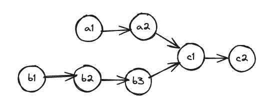
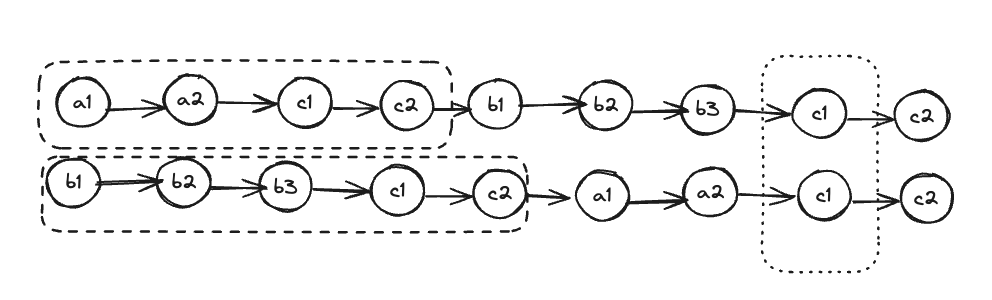

## 2.1 数组 链表
### 2.1.1 单链表的溜达解题套路
#### 2.1.1.1 合并两个有序链表
输入 L1=1->2->4, L2=1->3->4, 合并之后返回 1->1->2->3->4->4.
```python
def merge(l1: ListNode, l2: ListNode):
    dummy = ListNode()
    p = dummy

    while l1 is not None and l2 is not None:
        if l1.val > l2.val:
            p.next = l2
            l2 = l2.next
        else:
            p.next = l1
            l1 = l1.next
        p = p.next

    if l1 is not None:
        p.next = l1
    if l2 is not None:
        p.next = l2
        
    return dummy.next

```
#### 2.1.1.2 合并 k 个有序链表
比如 输入 [1->4->5, 1->3->4, 2->6] 返回 1->1->2->3->4->4->5->6. 难点在于如何快速的得到 K 个节点中的最小节点接到链上. 这里用到优先级队列这种能够自动排序的数据结构, 把链表节点放入一个最小堆, 就可以每次获得 k 个节点中的最小节点.
```python
import heapq
def merge(lists: [ListNode]):
    if len(lists)==0:
        return None
    dummy = ListNode()
    p = dummy
    h=[]

    for head in lists:
        heapq.heappush(h,head)

    while h:
        node = heapq.heappop(h)
        p.next = node
        if node.next is not None:
            heapq.heappush(h, node.next)
        p = p.next
    return dummy.next
``` 
算法复杂度多少?
优先级队列 h 中的元素个数最多 K, 一次 pop 或者 push 方法的时间复杂度 O(logK), 所有节点都会经历一次 pop和push, 所以总体复杂度是 O(NxlogK) K是链表的总数, N是这些链表的节点总数

#### 2.1.1.3 单链表的倒数第 K 个节点
```python
def findNode(head: ListNode, k: int):
    p1 = head
    for _ in range(k):
        p1 = p1.next
    p2 = head

    while p1:
        p2=p2.next
        p1=p1.next
    
    return p2
```
如果删除链表的倒数 第 N 个节点

```python
def delete(head: ListNode, int n):
    dummy = ListNode()
    dummy.next=head
    # 找到倒数 n+1 个节点
    temp = findNode(dummy, n+1)

    temp.next = temp.next.next

    return dummy.next

```
dummy来避免了 要你删除头节点时候 潜在的bug和复杂性. 比如一个5个节点 要你删除倒数第5个也就是第一个节点, 按照找到倒数第6个, 没有dummy就会有问题了. 

#### 2.1.1.4 单链表的中点
```python
def middleNode(head: ListNode):
    slow,fast = head,head
    while (fast is not None and fast.next is not None):
        slow = slow.next
        fast = fast.next.next
    return slow
```

##### 2.1.1.5 判断链表是否包含环
```python
def hasCycle(head: ListNode):
    slow,fast = head,head
    while fast is not None and fast.next is not None:
        slow = slow.next
        fast = fast.next

        if slow == fast:
            return True
    return False 

def detectCycle(head: ListNode):
    fast, slow = head, head
    
    while fast is not None and fast.next is not None:
        fast = fast.next.next
        slow = slow.next
        if (fast == slow):
            break
    if fast is None or fast.next is None:
        return None
    
    slow = head
    while slow != fast:
        fast = fast.next
        slow = slow.next
    return slow

```
##### 2.1.1.6 链表是否相交


让 P1 遍历完 A 表之后在遍历 B 让 P2 遍历完 B之后开始遍历 A. 如果有相交 会出现同时到达公共节点 如果没有则不存在公共节点
```python
def intersectionNode(headA: ListNode, headB: ListNode):
    p1,p2 = headA, headB
    while p1!=p2:
        
        if p1 is None:
            p1=headB
        else:
            # 不相交的时候 p1=none
            p1=p1.next
        
        if p2 is None:
            p2=headA
        else:
            # 不相交的时候 p2=none
            p2=p2.next
    # p1=p2=none jump off while
    return p1
```