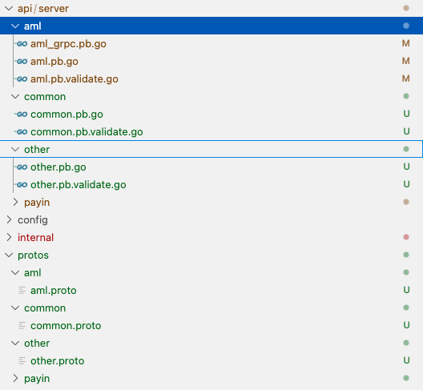
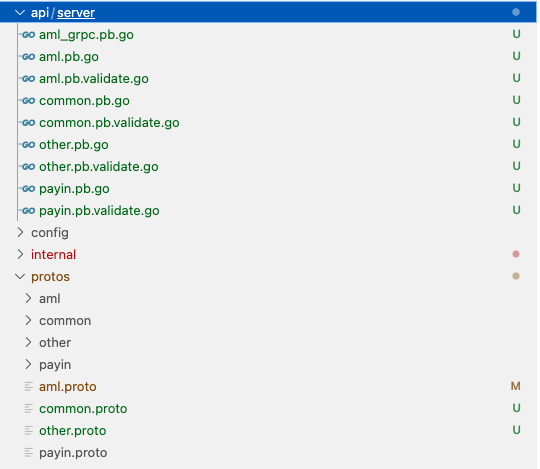

1. buf.yaml
```yaml
version: v2
modules:
  - path: protos
    lint:
      use:
        - DEFAULT
      except:
        - FIELD_NOT_REQUIRED
        - PACKAGE_NO_IMPORT_CYCLE
      disallow_comment_ignores: true
    breaking:
      use:
        - FILE
      except:
        - EXTENSION_NO_DELETE
        - FIELD_SAME_DEFAULT

deps:
  - buf.build/bufbuild/protovalidate
  - buf.build/googleapis/googleapis
  - buf.build/grpc-ecosystem/grpc-gateway
  - buf.build/grpc-ecosystem/protoc-gen-swagger
```
2. buf.gen.yaml
```yaml
version: v2
managed:
  enabled: true
plugins:
  - local: protoc-gen-go
    out: api/server
    opt: paths=source_relative
  - local: protoc-gen-go-grpc
    out: api/server
    opt: paths=source_relative
  - local: protoc-gen-validate
    out: api/server
    opt:
      - paths=source_relative
      - lang=go
```
WARNING: 这里的proto的文件结构是什么样子 生成的文件在 out 目录中的结构也是什么样子, 即使你在 proto 文件中 添加了 `option go_package="example.com/project/path/file"` 也不会创建不必要的文件夹

option go_package 定义了生成的 Go 代码的包名和导入路径，而 source_relative 影响的是生成的 Go 文件的物理位置。在没有 source_relative 选项的情况下，protoc 会将生成的文件放在与 go_package 选项中指定的导入路径相对应的目录中。使用 source_relative 可以确保生成的代码与 .proto 文件在同一目录结构中，这在某些项目结构中可能更方便。



3. common.proto
```proto
syntax = "proto3";
package common;
option go_package = "gitlab.pagsmile.com/transfersmile/xInternal/api/server/common";
import "buf/validate/validate.proto";
import "protoc-gen-openapiv2/options/annotations.proto";
import "google/api/annotations.proto";

message Req {}
```
4. other.proto
```proto
syntax = "proto3";
package other;
option go_package = "gitlab.pagsmile.com/transfersmile/xInternal/api/server/other";
import "buf/validate/validate.proto";
import "protoc-gen-openapiv2/options/annotations.proto";
import "google/api/annotations.proto";
import "common/common.proto";

message Other {
  common.Req other = 1;
}
```