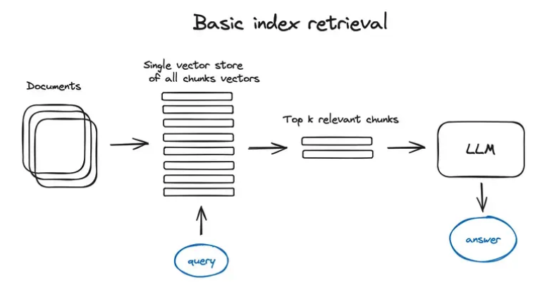
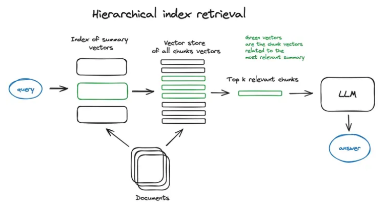
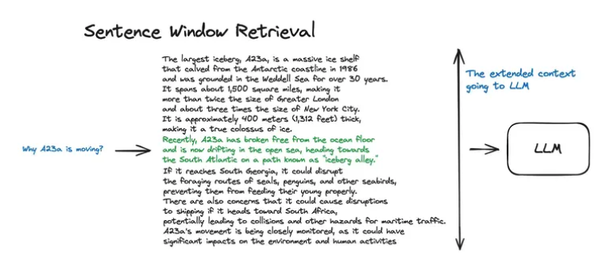
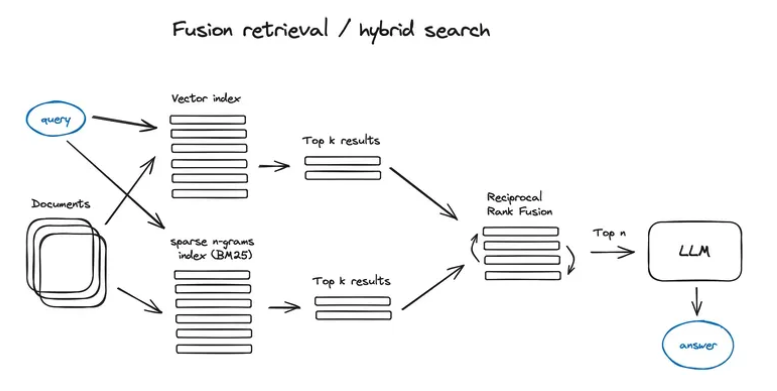
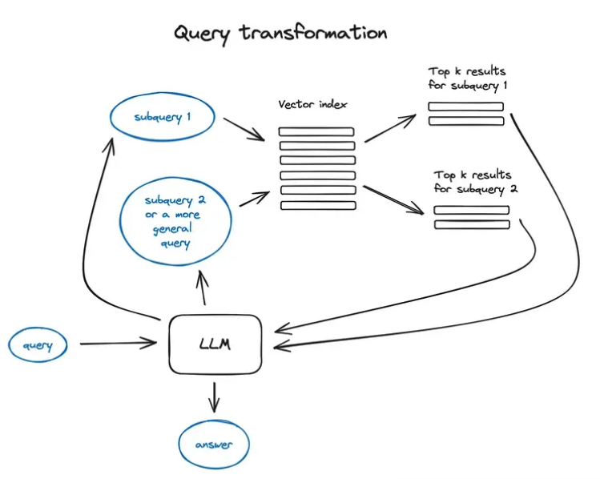
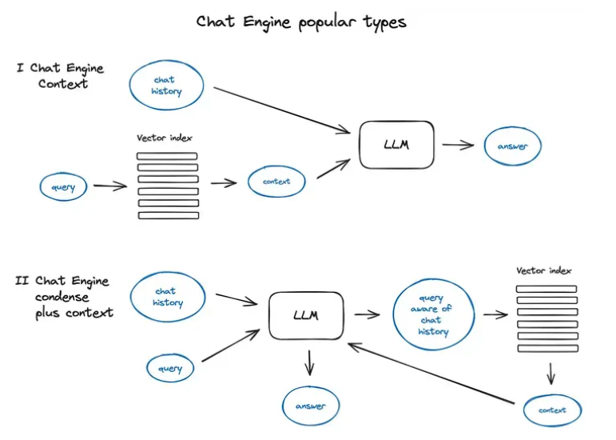
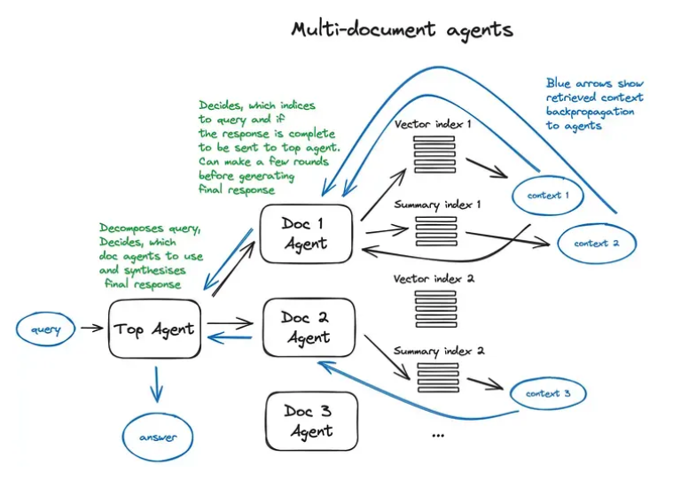

# Retrieval Augmented Generation
## 原始 RAG
1. 文本分块
2. Transformer Encoder 模型嵌入到向量中
3. 所有向量放入索引
4. 当用户提出一个查询（如一个问题）时，使用与文本块相同的Transformer Encoder模型将查询转换成一个向量
5. 使用向量搜索算法在索引中查找与查询向量最相似的top-k个文本块向量 这些相似性通常是通过计算向量之间的余弦相似度来确定的
6. 从数据库中(语料的向量数据库)检索相应的文本块 和 用户查询结合起来 形成一个Prompt 作为新的 input 给 LLM 如 GPT-3
7. 将LLM提示输入到预训练的大型语言模型中，模型会生成一个回答，这个回答是基于用户的原始查询和检索到的文本块的上下文信息

虽然 OpenAI 是 LLM 提供商的领头羊，但还有其他不少选择，例如 Anthropic 的 Claude，Mistral 的小型但功能强大的模型Mixtral，Microsoft 的Phi-2，以及如Llama2，OpenLLaMA，Falcon等众多开源模型，都可以供你选择最合适的，作为 RAG 管道大脑

## 高级 RAG
### 1. Chunking
块的大小取决于所使用的嵌入模型以及模型需要使用 token 的容量。如基于 BERT 的句子转换器，最多需要 512 个 token，OpenAI ada-002 能够处理更长的序列，如 8191 个 token，但这里的折衷是 LLM 有足够的上下文来推理，而不是足够具体的文本嵌入，以便有效地执行搜索。有一项关于块大小选择的研究。在 LlamaIndex 中，NodeParser 类很好支持解决这个问题，其中包含一些高级选项，例如定义自己的文本拆分器、元数据、节点/块关系等。
#### Vectorization
选择一个搜索优化的模型来嵌入我们的块。有很多选项，比如 bge-large 或 E5 嵌入系列。只需查看 MTEB 排行榜以获取最新更新即可。

有关分块和向量化步骤的 end2end 实现，请查看 LlamaIndex 中完整数据摄取管道的示例(https://docs.llamaindex.ai/en/latest/module_guides/loading/ingestion_pipeline/root.html#)

### 2. Query Index
#### Basic Index Retrieval

RAG 管道的关键部分是搜索索引，它存储了我们在上一步中获得的向量化内容。最原始的实现是使用平面索引 — 搜索时通过逐一比较查询向量与索引中每个向量之间的距离来找到最相似的项。这种方法也被称为暴力搜索（Brute-force Search）或线性搜索（Linear Search）。

为了实现1w+元素规模的高效检索，搜索索引应该采用向量索引，它可以高效地处理向量之间的相似性搜索，比如 faiss、nmslib 以及 annoy。这些工具基于近似最近邻居算法，如聚类、树结构或HNSW算法。
一种专门为高维向量数据设计的数据库索引向量索引的主要目的是优化最近邻（Nearest Neighbor）搜索，即在数据库中找到与查询点最接近的点。由于高维空间中的距离计算非常耗时，直接使用暴力搜索（即平面索引）在大规模数据集上是不切实际的。因此，向量索引采用了各种算法和数据结构来加速这一过程。包括但不限于:

1. 树形结构：如KD树（k-dimension tree）、球树（Ball Tree）等，通过构建树形数据结构来划分空间，从而减少搜索时需要比较的向量数量。

2. 哈希技术：如局部敏感哈希（Locality-Sensitive Hashing, LSH），通过将向量映射到哈希桶中来加速相似向量的查找。

3. 量化方法：如乘积量化（Product Quantization），通过将高维空间划分为子空间并对子空间进行量化，来减少存储需求和加速距离计算。

4. 图结构：如近似最近邻图（Approximate Nearest Neighbor Graph, ANNG），通过构建图结构并在图中搜索最近邻。

5. 分区索引：如IVFADC（Inverted File System with Asymmetric Distance Computation），通过将向量空间分区并构建倒排索引来加速搜索。

还有一些托管解决方案，如 OpenSearch、ElasticSearch。向量数据库，它们自动处理上面提到的数据摄取流程，例如Pinecone、Weaviate和Chroma。还可以存储元数据，并使用元数据过滤器来按照日期或来源等条件进行信息检索。LlamaIndex 支持多种向量存储索引，同时也兼容其他简单的索引类型，如列表索引、树索引和关键词表索引。
#### Hierarchical Index Retrieval

在大型数据库的情况下，一个有效的方法是创建两个索引——一个由摘要组成，另一个由文档块组成，然后分两步进行搜索，首先通过摘要过滤掉相关文档，然后只在这个相关组内搜索。
#### Hypothetical Question & HyDE

1. 为每个块生成问题：首先，我们有一系列的文本块，这些可以是文章、段落或者任何形式的文本数据。语言模型（LLM）为每个文本块生成一个相关的问题。这个问题应该能够代表或概括文本块的主要内容。

2. 问题向量嵌入：生成的问题随后被转换成向量形式。这通常是通过使用预训练的语言模型来完成的，比如BERT、GPT等，它们可以将文本转换为高维空间中的点，即向量。

3. 查询搜索：当用户提出一个查询时，这个查询也被转换成向量形式。然后，系统在问题向量的索引中执行搜索，而不是直接在文本块的索引中搜索。这意味着我们是在寻找与查询语义上最相似的问题。

4. 检索和路由：一旦找到最匹配的问题向量，系统将定位到与这些问题相对应的原始文本块。这些文本块随后被用作语言模型获取答案的上下文。

5. 提高搜索质量：这种方法的优势在于，用户的查询通常更容易与问题（由语言模型生成）在语义上匹配，而不是直接与原始文本块匹配。因为问题是为了捕捉文本块的核心意义而生成的，所以它们在语义上与用户的查询更加接近。

还有一种反向逻辑法 - 你要求 LLM 在给定查询的情况下生成一个假设的响应，然后将其向量与查询向量一起使用来提高搜索质量。

#### 内容增强
这里的内容是将相关的上下文组合起来供 LLM 推理，以检索较小的块以获得更好的搜索质量。

有两种选择：一种是围绕较小的检索块的句子扩展上下文，另一种是递归地将文档拆分为多个较大的父块，其中包含较小的子块。
##### 语句窗口检索
每个句子单独嵌入, 在获取最相关的单个句子后, 将上下文窗口扩展为检索到的句子前后的 k 个句子，然后将这个扩展的上下文发送到 LLM。

绿色部分是在索引中搜索时发现的句子嵌入，整个黑色 + 绿色段落被送到 LLM 以扩大其上下文，同时根据提供的查询进行推理。

##### 自动合并检索(父文档检索)
文档被拆分为较小的子块，这些子块和较大的父块有引用关系。在检索过程中获取较小的块，然后如果前 k 个检索到的块中有超过 n 个块链接到同一个父节点（较大的块），我们将这个父节点替换成给 LLM 的上下文。（请注意，搜索仅在子节点索引中执行）
##### Chunk Context
文本分块后确定其上下文关联性是一个挑战

1. 上下文窗口 Contextual Windows：在分块时，可以为每个块包含一些重叠的内容，这样每个块都会有一部分上下文信息。例如，如果你有一个长文本，你可以将其分成多个块，每个块开始和结束时包含前后块的一些内容。

2. 序列标记 Sequence Tagging：在分块时保留每个块的顺序信息，这样即使块被分开处理，你也可以通过序列来重建整个文本的流程。

3. 关键词和短语 Keywords and Phrases：提取每个块中的关键词和短语，这些可以作为线索来帮助确定块之间的关系。

4. 语义嵌入 Semantic Embeddings：使用自然语言处理技术，如BERT或GPT，为每个块生成语义嵌入。这些嵌入可以用来计算块之间的相似度，从而帮助确定它们之间的关联性。

5. 依赖分析 Dependency Parsing：进行句法依赖分析，以确定句子成分之间的关系。这可以帮助你理解不同块之间的语法结构如何相互关联。

6. 共指消解 Coreference Resolution：使用共指消解技术来识别文本中的实体（如人名、地点、组织等）在不同块中的提及，这有助于跟踪整个文本中的实体和事件。

7. 话题建模 Topic Modeling：应用话题建模技术，如LDA（Latent Dirichlet Allocation），来识别文本块中的主题，并将相关主题的块联系起来

#### 融合检索或混合检索
结合传统的基于关键字的搜索(稀疏检索)
1. TF-IDF（Term Frequency-Inverse Document Frequency）- 计算词项在文档中的频率与在所有文档中的逆文档频率的乘积。
    * TF(t,d) = (词项t在文档d中出现的次数) / (文档d中的总词项数)
    * IDF(t,D) = log_e(总文档数 / 包含词项t的文档数)
2. BM25 - 一种改进的TF-IDF算法，它考虑了文档长度的影响，并引入了一些参数来调整词项频率的饱和度和文档频率的影响。

语义搜索（密集检索）使用机器学习模型（如 BERT、GPT-3、Sentence-BERT 等）将查询和文档转换为向量空间中的点，然后通过计算向量之间的相似度（如余弦相似度）来检索相关文档

##### 结合方式1
如何组合不同相似度分数的检索结果。这个问题通常通过 Reciprocal Rank Fusion 算法来解决，该算法能有效地对检索结果进行重新排序，以得到最终的输出结果。LangChain 中，这种方法是通过 Ensemble Retriever 来实现的，该类将你定义的多个检索器结合起来，比如一个基于 faiss 的向量索引和一个基于 BM25 的检索器，并利用 RRF 算法进行结果的重排。
在 LlamaIndex 中，这一过程也是以类似的方式 实现 的。

##### 结合方式2
1. 用户输入搜索查询。
2. 使用 BM25 或 TF-IDF 算法在索引中快速检索出一组候选文档。
3. 同时，将用户查询和候选文档通过预训练的语义模型转换为向量。
4. 计算查询向量与每个候选文档向量之间的相似度。
5. 将两个阶段的得分结合起来，可以简单地通过加权和的方式来实现。
6. 根据组合后的得分对结果进行排序。
7. 返回最终的搜索结果列表。

### 3. Reranking & Filtering
使用上述任何算法获得了检索结果，现在是时候通过过滤、重排或一些转换来完善它们了。在 LlamaIndex 中，有各种可用的后处理器，根据相似性分数、关键字、元数据过滤掉结果，或使用其他模型（如 LLM）、sentence-transformer 交叉编码器，Cohere 重新排名接口或者基于元数据重排它们。

这是将检索到的上下文提供给 LLM 以获得结果答案之前的最后一步。

### 4. Query Transformation

查询转换是一系列技术，使用 LLM 作为推理引擎来修改用户输入以提高检索质量。有很多技术实现可供选择。

对于复杂的查询，大语言模型能够将其拆分为多个子查询。比如，

当你问：“在 Github 上，Langchain 和 LlamaIndex 这两个框架哪个更受欢迎？”，
我们不太可能直接在语料库找到它们的比较，所以将这个问题分解为两个更简单、具体的合理的子查询：

“Langchain 在 Github 上有多少星？”
“Llamaindex 在 Github 上有多少星？”

这些子查询会并行执行，检索到的信息随后被汇总到一个 LLM 提示词中。这两个功能分别在 Langchain 中以多查询检索器的形式和在 Llamaindex 中以子问题查询引擎的形式实现。
1. Step-back prompting 使用 LLM 生成一个更通用的查询，以此检索到更通用或高层次的上下文，用于为我们的原始查询提供答案。同时执行原始查询的检索，并在最终答案生成步骤中将两个上下文发送到 LLM。这是 LangChain 的一个示例实现。
2. 查询重写使用 LLM 来重新表述初始查询，以改进检索。LangChain 和 LlamaIndex 都有实现，个人感觉LlamaIndex 解决方案在这里更强大。

### 5. Chat Engine

构建一个可以多次用于单个查询的完美 RAG 系统的下一件工作是聊天逻辑，就像在 LLM 之前时代的经典聊天机器人中一样考虑到对话上下文。

这是支持后续问题、代词指代或与上一个对话上下文相关的任意用户命令所必需的。它是通过查询压缩技术解决的，将聊天上下文与用户查询一起考虑在内。

与往常一样，有几种方法可以进行上述上下文压缩——一个流行且相对简单的 ContextChatEngine，首先检索与用户查询相关的上下文，然后将其与内存缓冲区中的聊天记录一起发送到 LLM，以便 LLM 在生成下一个答案时了解上一个上下文

更复杂的情况是 CondensePlusContextMode
1. First condense a conversation and latest user message to a standalone question
2. Then build a context for the standalone question from a retriever,
3. Then pass the context along with prompt and user message to LLM to generate a response.

在多步骤聊天模式中，prompt可能是由用户消息、压缩后的问题和检索到的上下文信息组合而成的。这个组合的目的是为了提供足够的信息给语言模型，使其能够生成一个合适的回答。用户消息是prompt的一部分，但prompt通常包含更多的信息，以便更好地引导语言模型的回答过程。

需要注意的是，LlamaIndex 中还支持基于 OpenAI 智能体的聊天引擎，提供更灵活的聊天模式，Langchain 还支持 OpenAI 功能 API。

### 6. Routers
Routers are modules that take in a user query and a set of "choices", and returns one or more selected choices. “选项”（choices），指的是系统中可供选择的一系列资源或响应方式。这些选项通常是由系统的设计者预先定义好的，并且每个选项都会有相应的元数据描述，这些描述包含了关于该选项的信息，比如它的类型、内容、用途或者是它适用的特定场景等。

如果我们在谈论一个基于AI的问答系统，这些选项可能包括：

* 不同的数据集：比如维基百科、新闻文章、科学论文等。
* 不同的处理模块：比如用于理解自然语言的模块、用于检索信息的模块、用于生成语言的模块等。
* 不同的服务或API：比如天气信息服务、地图服务、翻译服务等。

当用户提出一个查询时，Router会根据这些选项的元数据和用户的查询内容，决定哪些选项最有可能提供满足用户需求的答案或服务。然后，Router会选择一个或多个最佳选项，继续处理用户的查询。

举个例子，如果用户问：“今天纽约的天气怎么样？”Router可能会从选项中选择“天气信息服务”，因为它的元数据表明这个选项可以提供地理位置的天气信息。然后，系统会使用这个服务来回答用户的问题。

LlamaIndex 和 LangChain 都提供了对查询路由器的支持。

### 7. Agent 
1. 任务执行者：Agent被赋予了一个任务，比如生成文档摘要或回答问题。
2. 工具集成者：Agent可以调用确定性功能，如代码函数、外部API，甚至是其他Agent，以完成其任务。
3. 智能体链：Agent可以与其他Agent相连，形成一个智能体链（LangChain），这样可以在处理复杂任务时相互协作。
4. 上下文感知：Agent能够理解和利用上下文信息，以提供更准确和相关的响应。
5. 多文档处理：在多文档智能体方案中，每个文档都有一个对应的Agent，它们各自处理文档内容，并将结果汇总给一个顶层Agent，后者负责综合所有信息并形成最终答案。
6. 函数调用API：Agent可以通过函数调用API将自然语言指令转换为对外部工具或数据库的查询，这是OpenAI助手的一个关键功能。

总的来说，Agent在这里是一个基于LLM的智能系统，它通过集成多种工具和API，能够处理复杂的自然语言处理任务，并在多个文档之间进行信息检索和整合。

多文档智能体的方案是一个非常复杂的配置，涉及到在每个文档上初始化一个Agent（OpenAIAgent），该智能体能进行文档摘要制作和传统问答机制的操作，还有一个顶层智能体，负责将查询分配到各个文档智能体，并综合形成最终的答案. 

每个文档智能体都有两个工具：向量存储索引和摘要索引，它根据路由查询决定使用哪一个。对于顶级智能体来说，所有文档智能体都是其工具。对于大型的多文档存储，我建议考虑对此方案进行简化，以便实现扩展。

### 8. Response Synthesize
这是任何 RAG 管道的最后一步——根据我们检索的所有上下文和初始用户查询生成答案。

最简单的方法是将所有获取的上下文（高于某个相关性阈值）与查询一起连接并提供给 LLM。但是，与往常一样，还有其他更复杂的选项，涉及多个 LLM 调用，以优化检索到的上下文并生成更好的答案。

响应合成的主要方法有：
* 通过将检索到的上下文逐块发送到 LLM 来优化答案
* 概括检索到的上下文，以适应提示
* 根据不同的上下文块生成多个答案，然后将它们连接或概括起来