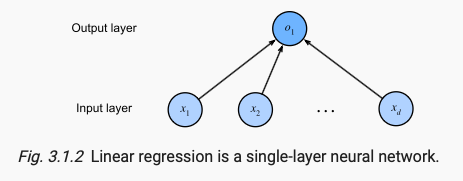

#### 3.1.1.2. Loss Function
损失函数（loss function）能够量化目标的实际值与预测值之间的差距。 通常我们会选择非负数作为损失，且数值越小表示损失越小，完美预测时的损失为0。 回归问题中最常用的损失函数是平方误差函数。

#### 3.1.1.3  Analytic Solution
像线性回归这样的简单问题存在解析解，但并不是所有的问题都存在解析解。 解析解可以进行很好的数学分析，但解析解对问题的限制很严格，导致它无法广泛应用在深度学习里。

解析解(analytical solution)是严格按照公式逻辑推导得到的，具有基本的函数形式: ±√2

数值解(numerical solution)是采用某种计算方法，在特定的条件下得到的一个近似数值结果，如有限元法，数值逼近法，插值法等等得到的解: 其数值解为：±1.414213......

#### 3.1.1.4 小批量随机梯度下降 Minibatch Stochastic Gradient Descent
Fortunately, even in cases where we cannot solve the models analytically, we can still often train models effectively in practice. 本书中我们用到一种名为梯度下降（gradient descent）的方法， 这种方法几乎可以优化所有深度学习模型。 它通过不断地在损失函数递减的方向上更新参数来降低误差。

### 3.1.2 矢量化加速 Vectorization for Speed
简单来说就是 
```python
c = torch.zeros(n)
for i in range(n):
    c[i] = a[i] + b[i]

d = a + b
```
d 比 c计算的快的多

### 3.1.3 正态分布与平方损失 The Normal Distribution and Squared Loss
Python函数来计算正态分布
```python
def normal(x, mu, sigma):
    p = 1 / math.sqrt(2 * math.pi * sigma**2)
    return p * np.exp(-0.5 / sigma**2 * (x - mu)**2)
```
极大似然估计和高斯分布之间存在密切关系，因为高斯分布（也称为正态分布）是一种连续概率分布，而极大似然估计是估计分布参数的方法之一。

对于高斯分布，其概率密度函数是一个钟形曲线，其形状由两个参数确定：均值（μ）和方差（σ²）。在极大似然估计中，假设观察到了一些数据点，并且我们希望确定哪些参数值能够最大化生成这些数据点的概率。

当数据点来自高斯分布时，利用极大似然估计可以估计这个高斯分布的参数，即均值和方差，使得这组参数下生成观测数据的概率最大化。因此，极大似然估计可以用于确定给定数据集的最佳高斯分布参数，使得该分布最有可能产生观测到的数据点。


    在统计学中，我们经常需要根据观测数据来估计一个未知的概率分布的参数。极大似然估计提供了一种基于观测数据选择参数的原则，即选择使得观测数据出现概率最大的参数值。
    具体来说，假设我们有一组观测数据，这组数据是从某个未知参数的概率分布中独立同分布地抽取出来的。我们不知道这个分布的参数是什么，但我们可以假设一个概率模型（例如正态分布、二项分布等），该模型中包含了一个或多个未知参数。极大似然估计的目标就是找到这些参数的值，使得我们观测到的数据在这个假设的概率模型下出现的概率（即似然）最大。

    从物理意义上讲，极大似然估计反映了一种“自然选择”的思想：在所有可能的参数值中，那些使得已观测到的数据出现概率最大的参数值是最有可能是真实参数值的候选者。换句话说，极大似然估计是一种数据驱动的方法，它依据数据本身来推断模型的参数，而不是依赖于外部的假设或先验知识。
    在实际应用中，极大似然估计的物理意义还体现在其对数据的利用效率和在许多情况下的优良统计性质（如一致性和渐进正态性），这使得MLE成为统计参数估计中非常重要和广泛使用的一种方法。


#### 让我们通过高斯分布（正态分布）来解释极大似然估计（MLE）
假设我们有一组观测数据 ( $X = {x_1, x_2, ..., x_n} $)，这些数据来自于一个高斯分布，即每个数据点 ( $x_i$ ) 都是独立地从 ( $N(\mu, \sigma^2)$ ) 中抽取的，其中 ( $\mu$ ) 是均值，( $\sigma^2$ ) 是方差。我们的目标是估计这个分布的参数 ( $\mu$ ) 和 ( $\sigma^2$ )。

高斯分布的概率密度函数（PDF）为：\
$f(x|\mu, \sigma^2) = \frac{1}{\sqrt{2\pi\sigma^2}} \exp\left(-\frac{(x-\mu)^2}{2\sigma^2}\right)$

给定我们的数据集 ( X )，似然函数 ( L ) 是所有数据点概率密度函数的乘积\
$L(\mu, \sigma^2) = \prod_{i=1}^{n} f(x_i|\mu, \sigma^2) $

对数似然函数 ( $\ln L$ ) 是：\
$\ln L(\mu, \sigma^2) = \sum_{i=1}^{n} \ln f(x_i|\mu, \sigma^2)$\
$= -\frac{n}{2} \ln(2\pi) - \frac{n}{2} \ln(\sigma^2) - \frac{1}{2\sigma^2} \sum_{i=1}^{n} (x_i - \mu)^2$

为了找到 ( $\mu$ ) 和 ($ \sigma^2$ ) 的估计值，我们需要最大化对数似然函数。我们分别对 ( $\mu$ ) 和 ($ \sigma^2 $) 求导，并令导数等于零。\
对 ( $\mu$ ) 求导：

$ \frac{\partial}{\partial \mu} \ln L(\mu, \sigma^2) = \frac{1}{\sigma^2} \sum_{i=1}^{n} (x_i - \mu) = 0 $\
解得：

$\hat{\mu} = \frac{1}{n} \sum_{i=1}^{n} x_i$

这就是 ( $\mu$ ) 的极大似然估计，它等于样本均值。

接下来，对 ( $\sigma^2$ ) 求导：

$ \frac{\partial}{\partial \sigma^2} \ln L(\mu, \sigma^2) = -\frac{n}{2\sigma^2} + \frac{1}{2(\sigma^2)^2} \sum_{i=1}^{n} (x_i - \mu)^2 = 0 $

解得：

$\hat{\sigma^2} = \frac{1}{n} \sum_{i=1}^{n} (x_i - \hat{\mu})^2 $

这就是 ( $\sigma^2$ ) 的极大似然估计，它等于样本方差。

因此，通过极大似然估计，我们可以得到高斯分布参数的估计值：均值 ( $\mu$ ) 的估计是样本均值，方差 ( $\sigma^2$ ) 的估计是样本方差。这些估计值最大化了在给定参数下观察到的数据的概率。

### 3.1.4 Linear Regression as a Neural Network
(artificial) neural networks are rich enough to subsume linear models as networks in which every feature is represented by an input neuron, all of which are connected directly to the output.


The inputs are $x_1,x_2,...x_d$. We refer to $d$ as the number of inputs or the feature dimensionality in the input layer. 需要注意的是，输入值都是已经给定的，并且只有一个计算神经元。 由于模型重点在发生计算的地方，所以通常我们在计算层数时不考虑输入层。 也就是说， 图3.1.2中神经网络的层数为1。 我们可以将线性回归模型视为仅由单个人工神经元组成的神经网络，或称为单层神经网络。

每个输入都与每个输出（在本例中只有一个输出）相连， 我们将这种变换（ 图3.1.2中的输出层） 称为全连接层（fully-connected layer）或称为稠密层（dense layer）。

