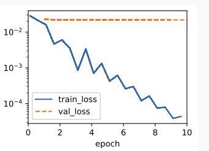
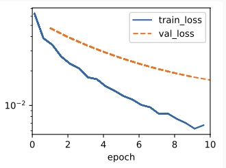
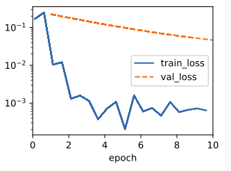

## 3.6 Weight Decay

### 3.6.1 Norms and Weight Decay
Rather than directly manipulating the number of parameters, weight decay, operates by restricting the values that the parameters can take. More commonly called $l2$  regularization outside of deep learning circles when optimized by minibatch stochastic gradient descent, weight decay might be the most widely used technique for regularizing parametric machine learning models. 这项技术的动机基于这样一个基本直觉：在所有函数 f 中，函数 f=0（将所有输入值分配为0）在某种意义上是最简单的，我们可以通过其参数与零的距离来衡量函数的复杂性。但是我们应该如何精确地衡量函数与零之间的距离呢？这并没有单一的正确答案。事实上，整个数学领域，包括泛函分析和巴拿赫空间理论的部分，都致力于解决这类问题。

### 3.6.2. High-Dimensional Linear Regression
We can illustrate the benefits of weight decay through a simple synthetic example.
$y = 0.05 + \sum_{d}^{i=1}0.01x_i + \sigma$
```python
class Data(d2l.DataModule):
    def __init__(self, num_train, num_val, num_inputs, batch_size):
        self.save_hyperparameters()
        n = num_train + num_val
        self.X = torch.randn(n, num_inputs)
        noise = torch.randn(n, 1) * 0.01
        w, b = torch.ones((num_inputs, 1)) * 0.01, 0.05
        self.y = torch.matmul(self.X, w) + b + noise

    def get_dataloader(self, train):
        i = slice(0, self.num_train) if train else slice(self.num_train, None)
        return self.get_tensorloader([self.X, self.y], train, i)
```

### 3.6.3. Implementation from Scratch
Now, let’s try implementing weight decay from scratch. Since minibatch stochastic gradient descent is our optimizer, we just need to add the squared $l_2$ penalty to the original loss function.

#### 3.6.3.1 Defining l2 Norm Penalty
Perhaps the most convenient way of implementing this penalty is to square all terms in place and sum them.
```python
def l2_penalty(w):
    return (w ** 2).sum() / 2
```
#### 3.6.3.2. Defining the Model
In the final model, the linear regression and the squared loss have not changed since Section 3.4, so we will just define a subclass of d2l.LinearRegressionScratch. The only change here is that our loss now includes the penalty term.
```python
class WeightDecayScratch(d2l.LinearRegressionScratch):
    def __init__(self, num_inputs, lambd, lr, sigma=0.01):
        super().__init__(num_inputs, lr, sigma)
        self.save_hyperparameters()

    def loss(self, y_hat, y):
        return (super().loss(y_hat, y) +
                self.lambd * l2_penalty(self.w))
```

The following code fits our model on the training set with 20 examples and evaluates it on the validation set with 100 examples.
```python
data = Data(num_train=20, num_val=100, num_inputs=200, batch_size=5)
trainer = d2l.Trainer(max_epochs=10)

def train_scratch(lambd):
    model = WeightDecayScratch(num_inputs=200, lambd=lambd, lr=0.01)
    model.board.yscale='log'
    trainer.fit(model, data)
    print('L2 norm of w:', float(l2_penalty(model.w)))
```

#### 3.6.3.3 Training without Regularization
We now run this code with lambd = 0, disabling weight decay. Note that we overfit badly, decreasing the training error but not the validation error—a textbook case of overfitting.
```python
train_scratch(0)
# L2 norm of w: 0.009948714636266232
```


#### 3.6.3.4 Using Weight Decay
Below, we run with substantial weight decay. Note that the training error increases but the validation error decreases. This is precisely the effect we expect from regularization.
```python
train_scratch(3)
# L2 norm of w: 0.0017270983662456274
```


### 3.6.4. Concise Implementation
We specify the weight decay hyperparameter directly through weight_decay when instantiating our optimizer. By default, PyTorch decays both weights and biases simultaneously, but we can configure the optimizer to handle different parameters according to different policies. Here, we only set weight_decay for the weights (the net.weight parameters), hence the bias (the net.bias parameter) will not decay.

```python
class WeightDecay(d2l.LinearRegression):
    def __init__(self, wd, lr):
        super().__init__(lr)
        self.save_hyperparameters()
        self.wd = wd

    def configure_optimizers(self):
        return torch.optim.SGD([
            {'params': self.net.weight, 'weight_decay': self.wd},
            {'params': self.net.bias}], lr=self.lr)

model = WeightDecay(wd=3, lr=0.01)
model.board.yscale='log'
trainer.fit(model, data)

print('L2 norm of w:', float(l2_penalty(model.get_w_b()[0])))
# L2 norm of w: 0.013779522851109505
```
