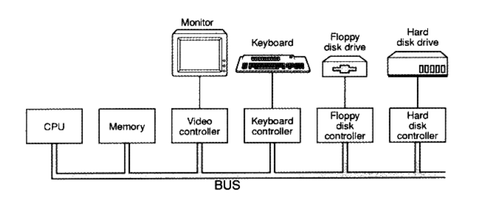

# 1 温故知新
1. 起初 CPU 核心频率不高 和内存的频率一样 直接连在同一个总线上. 由于 IO设备和磁盘等速度与CPU和内存相比慢很多, 当时没有复杂的图形设备, 显示设备大多只能输出字符, 为了协调 IO 设备和总线之间的速度 以及让 CPU和IO设备通信, 一般每个设备都会有一个相应的 IO 控制器. 

后来CPU核心频率提升, 内存跟不上CPU速度, 产生了与内存频率一致的系统总线, CPU采用倍频的方式与系统总线进行通信.

再后来图形化的操作系统普及, 3D游戏和多媒体发展, 